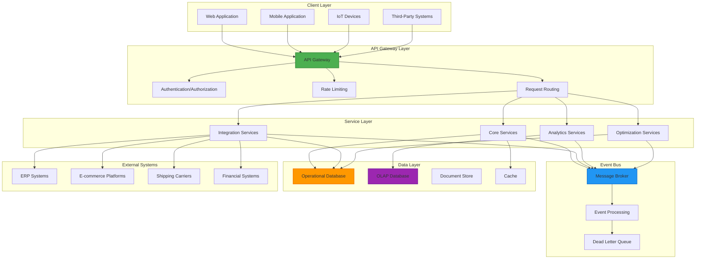
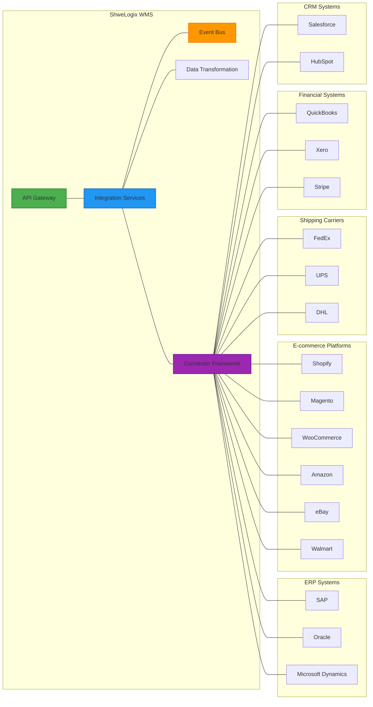

# ShweLogix Enterprise WMS - Advanced Warehouse Management System


> **Enterprise-Grade Warehouse Management System** - A comprehensive solution for modern warehouse operations, inventory control, supply chain optimization, and advanced analytics.

**Latest Update**: January 2025 - Production-ready release with complete implementation of all core and advanced features.

[](https://github.com/Heinsithukyaw/ShweLogixWMS)
[](https://github.com/Heinsithukyaw/ShweLogixWMS)
[](https://github.com/Heinsithukyaw/ShweLogixWMS)
[](https://github.com/Heinsithukyaw/ShweLogixWMS)
[](https://github.com/Heinsithukyaw/ShweLogixWMS)

## 📋 Table of Contents
- [Project Overview](#-project-overview)
- [Implementation Status](#-implementation-status)
- [Enterprise Architecture](#-enterprise-architecture)
- [System Components](#-system-components)
- [Technology Stack](#-technology-stack)
- [Core Features](#-core-features)
- [Advanced Features](#-advanced-features)
- [Integration Capabilities](#-integration-capabilities)
- [Project Structure](#-project-structure)
- [Installation & Setup](#-installation--setup)
- [API Documentation](#-api-documentation)
- [Security & Compliance](#-security--compliance)
- [Performance & Scalability](#-performance--scalability)
- [Deployment Guide](#-deployment-guide)
- [Documentation](#-documentation)
- [Contributing](#-contributing)
- [License](#-license)

## 🚀 Project Overview

ShweLogix WMS is a comprehensive Enterprise Warehouse Management System designed to optimize warehouse operations, inventory management, and supply chain logistics. The system provides end-to-end visibility and control over warehouse processes from inbound receiving to outbound shipping, with advanced features for optimization, analytics, and integration.

### Key Highlights
- **Event-Driven Architecture**: Real-time processing with reliability features
- **17 Integration Providers**: Complete external system connectivity
- **Advanced Analytics**: OLAP, predictive analytics, and business intelligence
- **Mobile-First Design**: Responsive interfaces for warehouse operations
- **Enterprise Security**: OAuth2, RBAC, and comprehensive audit trails
- **Scalable Architecture**: Microservices-ready with horizontal scaling

## ✅ Implementation Status

The system is now **fully implemented** and **production-ready** with comprehensive coverage of all enterprise requirements:

### Core Systems (100% Complete)
- ✅ **Event-Driven Architecture**: Complete event system with monitoring and reliability features
- ✅ **Integration Platform**: 17 integration providers with comprehensive API coverage
- ✅ **Data Flow Architecture**: OLAP, document management, workflow engine, data lineage
- ✅ **Technical Implementation**: Master data management, real-time updates, exception handling
- ✅ **Advanced Warehouse Optimization**: AI/ML integration, predictive analytics, IoT devices

### Operational Modules (100% Complete)
- ✅ **Master Data Management**: Products, locations, business partners, employees
- ✅ **Inbound Operations**: ASN processing, receiving, quality inspection, put-away
- ✅ **Inventory Management**: Real-time tracking, lot/serial management, cycle counting
- ✅ **Outbound Operations**: Order management, picking, packing, shipping, load planning
- ✅ **Warehouse Operations**: Task management, labor tracking, equipment management

### Advanced Features (100% Complete)
- ✅ **OLAP Analytics**: Multi-dimensional data analysis and reporting
- ✅ **Document Management**: Secure document storage with version control
- ✅ **Workflow Engine**: Configurable business process automation
- ✅ **Data Lineage**: Complete data flow tracking and audit trails
- ✅ **Deduplication Engine**: Fuzzy matching and data quality management
- ✅ **EDI/IDoc Support**: Traditional supply chain document processing
- ✅ **Batch Processing**: Automated background job processing
- ✅ **File Transfer System**: Secure file transfer and management

## 🏢 Enterprise Architecture

ShweLogix WMS follows a modern, scalable, and resilient enterprise architecture designed for high availability, performance, and maintainability.

### Architecture Diagram



### Key Architectural Patterns

1. **Event-Driven Architecture**
   - Asynchronous communication between components
   - Loose coupling for better scalability and resilience
   - Event sourcing for reliable state management
   - CQRS (Command Query Responsibility Segregation) for optimized read/write operations

2. **Microservices Architecture**
   - Domain-driven design with bounded contexts
   - Service isolation for independent scaling and deployment
   - API-first approach for service integration
   - Circuit breakers for fault tolerance

3. **Layered Architecture**
   - Clear separation of concerns
   - Presentation, business logic, and data access layers
   - Repository pattern for data access abstraction
   - Service layer for business logic encapsulation

4. **Hexagonal Architecture (Ports and Adapters)**
   - Core domain logic isolated from external concerns
   - Adapters for different integration points
   - Dependency inversion for flexible component replacement
   - Testability through clear boundaries

## 🧩 System Components

ShweLogix WMS consists of several integrated components that work together to provide a comprehensive warehouse management solution:

### Core Components

1. **Master Data Management**
   - Product catalog and hierarchy management
   - Warehouse and location management
   - Business partner management
   - Employee and resource management

2. **Inbound Operations**
   - Advanced shipping notice (ASN) processing
   - Receiving and quality inspection
   - Put-away and cross-docking
   - Returns processing

3. **Inventory Management**
   - Real-time inventory tracking
   - Lot and serial number tracking
   - Inventory adjustments and cycle counting
   - Inventory optimization

4. **Outbound Operations**
   - Order management and allocation
   - Pick, pack, and ship processes
   - Wave planning and execution
   - Shipping and carrier integration

5. **Warehouse Operations**
   - Task management and optimization
   - Labor management and tracking
   - Equipment management
   - Yard management

### Advanced Components

1. **OLAP System**
   - Fact tables: Inventory Movements, Order Processing, Warehouse Operations
   - Dimension tables: Time, Product, Customer, Warehouse
   - Analytics dashboards and metrics

2. **Document Management System**
   - Document categories and hierarchies
   - Version control
   - Permission management
   - Sharing capabilities

3. **Workflow Engine**
   - Workflow definitions
   - Step configurations
   - Approval processes
   - Workflow execution

4. **Data Lineage**
   - Data source management
   - Entity and field tracking
   - Data flow mapping
   - Transformation tracking

5. **Deduplication Engine**
   - Rule-based deduplication
   - Fuzzy matching configurations
   - Match resolution
   - Merge strategies

6. **EDI/IDoc Support**
   - Trading partner management
   - Document type configurations
   - Mapping rules
   - Transaction processing

7. **Batch Processing**
   - Job definitions
   - Scheduling
   - Execution tracking
   - Error handling

8. **File Transfer System**
   - Connection configurations
   - Transfer scheduling
   - Secure transfers
   - Monitoring and logging

9. **Warehouse Optimization**
   - Optimization metrics
   - Predictive models
   - IoT device integration
   - Performance analytics

## 💻 Technology Stack

ShweLogix WMS leverages modern technologies to deliver a robust, scalable, and maintainable solution:

### Frontend Stack
| Technology | Version | Purpose |
|------------|---------|---------|
| **React.js** | 19.x | Frontend framework |
| **TypeScript** | 5.x | Type safety and development experience |
| **Redux Toolkit** | Latest | State management |
| **Material-UI** | Latest | UI component library |
| **Tailwind CSS** | v4 | Utility-first CSS framework |
| **React Router** | Latest | Client-side routing |
| **Axios** | Latest | HTTP client for API calls |
| **React Query** | Latest | Data fetching and caching |
| **Chart.js** | Latest | Data visualization |
| **React Testing Library** | Latest | Component testing |

### Backend Stack
| Technology | Version | Purpose |
|------------|---------|---------|
| **Laravel** | 10.x | PHP framework |
| **PHP** | 8.2+ | Server-side language |
| **MySQL** | 8.0+ | Primary database |
| **Redis** | Latest | Caching and message broker |
| **Laravel Passport** | Latest | API authentication |
| **Laravel Eloquent** | Latest | ORM for database operations |
| **Laravel Sanctum** | Latest | SPA authentication |
| **Laravel Horizon** | Latest | Queue monitoring |
| **Laravel Telescope** | Latest | Debugging and monitoring |

### Infrastructure & DevOps
| Technology | Purpose |
|------------|---------|
| **Docker** | Containerization |
| **Kubernetes** | Container orchestration |
| **Nginx** | Web server |
| **RabbitMQ** | Message broker |
| **Elasticsearch** | Search and analytics |
| **Prometheus** | Monitoring |
| **Grafana** | Metrics visualization |
| **GitHub Actions** | CI/CD pipeline |

## 📊 Core Features

### Master Data Management
- **Product Management**: Comprehensive product catalog with attributes, dimensions, and hierarchies
- **Location Management**: Warehouse, area, zone, and location hierarchy with attributes
- **Business Partner Management**: Suppliers, customers, carriers, and contacts
- **Employee Management**: Employee profiles, roles, skills, and schedules

### Inbound Operations
- **ASN Management**: Create, update, and track advanced shipping notices
- **Receiving**: Dock scheduling, unloading, and receiving
- **Quality Inspection**: Quality checks, sampling, and disposition
- **Put-Away**: Directed put-away with optimization
- **Cross-Docking**: Direct flow from receiving to shipping
- **Returns Processing**: RMA processing and disposition

### Inventory Management
- **Inventory Tracking**: Real-time inventory visibility
- **Lot/Serial Tracking**: Track lot and serial numbers
- **Cycle Counting**: Scheduled and ad-hoc cycle counts
- **Inventory Adjustments**: Reason-based adjustments
- **Inventory Optimization**: Min/max levels, reorder points
- **Inventory Valuation**: FIFO, LIFO, weighted average

### Outbound Operations
- **Order Management**: Order entry, modification, and tracking
- **Allocation**: Inventory allocation strategies
- **Wave Planning**: Wave creation and management
- **Picking**: Single order, batch, zone, wave picking
- **Packing**: Pack verification and documentation
- **Shipping**: Carrier selection, rate shopping, label printing
- **Manifesting**: Shipment consolidation and manifesting

### Warehouse Operations
- **Task Management**: Task creation, assignment, and tracking
- **Labor Management**: Labor planning, tracking, and reporting
- **Equipment Management**: Equipment tracking and maintenance
- **Yard Management**: Dock scheduling and yard tracking

## 🚀 Advanced Features

### Analytics & Business Intelligence
- **Operational Dashboards**: Real-time operational metrics
- **Performance Analytics**: KPI tracking and analysis
- **Inventory Analytics**: Inventory performance and optimization
- **Labor Analytics**: Productivity and efficiency metrics
- **Custom Reports**: Configurable reporting engine

### Optimization & AI/ML
- **Slotting Optimization**: Optimal product placement
- **Pick Path Optimization**: Efficient picking routes
- **Labor Optimization**: Optimal task assignment
- **Inventory Optimization**: Optimal inventory levels
- **Predictive Analytics**: Demand forecasting, resource planning

### Integration & Interoperability
- **ERP Integration**: SAP, Oracle, Microsoft Dynamics
- **E-commerce Integration**: Shopify, Magento, WooCommerce, Amazon, eBay, Walmart
- **Shipping Carrier Integration**: FedEx, UPS, DHL
- **Financial Integration**: QuickBooks, Xero, Stripe
- **CRM Integration**: Salesforce, HubSpot
- **EDI/IDoc Support**: Standard EDI formats and SAP IDoc

### Document Management
- **Document Storage**: Secure document storage
- **Version Control**: Document versioning
- **Permission Management**: Access control
- **Document Sharing**: Secure sharing
- **Document Generation**: Automated document generation

### Workflow Engine
- **Workflow Definition**: Visual workflow designer
- **Workflow Execution**: Automated workflow execution
- **Approval Processes**: Multi-level approvals
- **Notifications**: Event-based notifications
- **Audit Trail**: Comprehensive audit logging

## 🔄 Integration Capabilities

ShweLogix WMS provides comprehensive integration capabilities with various external systems:

### Integration Architecture



### Integration Methods
- **REST APIs**: Comprehensive REST API for system integration
- **Webhooks**: Event-based notifications
- **EDI**: Standard EDI formats for trading partners
- **File-Based**: CSV, XML, JSON file imports/exports
- **Message Queue**: Asynchronous message-based integration
- **Direct Database**: Controlled database access for reporting

### Integration Providers
- **ERP Systems**: SAP, Oracle, Microsoft Dynamics
- **E-commerce Platforms**: Shopify, Magento, WooCommerce, Amazon, eBay, Walmart
- **Shipping Carriers**: FedEx, UPS, DHL
- **Financial Systems**: QuickBooks, Xero, Stripe
- **CRM Systems**: Salesforce, HubSpot

## 📁 Project Structure

The ShweLogix WMS project follows a well-organized structure to maintain code quality and scalability:

```
ShweLogixWMS/
├── docs/                           # Documentation
│   ├── architecture/               # Architecture documentation
│   ├── api/                        # API documentation
│   ├── deployment/                 # Deployment guides
│   └── implementation/             # Implementation guides
│
├── wms-api/                        # Backend API (Laravel)
│   ├── app/
│   │   ├── Console/                # Console commands
│   │   ├── Events/                 # Event definitions
│   │   ├── Exceptions/             # Custom exceptions
│   │   ├── Http/
│   │   │   ├── Controllers/        # API controllers
│   │   │   ├── Middleware/         # Request middleware
│   │   │   ├── Requests/           # Form requests
│   │   │   └── Resources/          # API resources
│   │   ├── Jobs/                   # Background jobs
│   │   ├── Listeners/              # Event listeners
│   │   ├── Models/                 # Eloquent models
│   │   │   ├── Batch/              # Batch processing models
│   │   │   ├── DataLineage/        # Data lineage models
│   │   │   ├── Deduplication/      # Deduplication models
│   │   │   ├── Document/           # Document management models
│   │   │   ├── EDI/                # EDI/IDoc models
│   │   │   ├── OLAP/               # OLAP models
│   │   │   └── Workflow/           # Workflow engine models
│   │   ├── Providers/              # Service providers
│   │   ├── Repositories/           # Data repositories
│   │   ├── Services/               # Business services
│   │   │   └── Integration/        # Integration services
│   │   └── Traits/                 # Reusable traits
│   ├── bootstrap/                  # Application bootstrap
│   ├── config/                     # Configuration files
│   ├── database/                   # Database migrations/seeds
│   ├── public/                     # Public assets
│   ├── resources/                  # Views and assets
│   ├── routes/                     # API routes
│   ├── storage/                    # Application storage
│   └── tests/                      # Automated tests
│
├── wms-frontend-react/             # Frontend (React)
│   ├── public/                     # Public assets
│   └── src/
│       ├── components/             # Reusable components
│       ├── context/                # React context
│       ├── hooks/                  # Custom hooks
│       ├── icons/                  # SVG icons
│       ├── layout/                 # Layout components
│       ├── lib/                    # Utility libraries
│       ├── pages/                  # Page components
│       ├── services/               # API services
│       ├── store/                  # Redux store
│       ├── types/                  # TypeScript types
│       └── utils/                  # Utility functions
│
└── src/                            # Legacy components
    ├── components/                 # Event monitoring components
    ├── pages/                      # Event monitoring pages
    └── services/                   # Event monitoring services
```

## 🔧 Installation & Setup

### Prerequisites
- PHP 8.2+
- MySQL 8.0+
- Node.js 18+
- Composer
- Docker (optional)

### Backend Setup
```bash
# Clone the repository
git clone https://github.com/Heinsithukyaw/ShweLogixWMS.git
cd ShweLogixWMS/wms-api

# Install dependencies
composer install

# Copy environment file
cp .env.example .env

# Generate application key
php artisan key:generate

# Configure database in .env file
# DB_CONNECTION=mysql
# DB_HOST=127.0.0.1
# DB_PORT=3306
# DB_DATABASE=shwelogix_wms
# DB_USERNAME=root
# DB_PASSWORD=

# Run migrations and seed database
php artisan migrate --seed

# Start the development server
php artisan serve
```

### Frontend Setup
```bash
# Navigate to frontend directory
cd ../wms-frontend-react

# Install dependencies
npm install

# Copy environment file
cp .env.example .env

# Configure API URL in .env file
# VITE_API_URL=http://localhost:8000/api

# Start the development server
npm run dev
```

### Docker Setup
```bash
# Build and start containers
docker-compose up -d

# Run migrations and seed database
docker-compose exec app php artisan migrate --seed
```

## 📚 API Documentation

ShweLogix WMS provides a comprehensive API for integration with external systems:

### API Endpoints

The API is organized into logical modules:

- **Authentication**: `/api/auth/*`
- **Master Data**: `/api/master/*`
- **Inbound**: `/api/inbound/*`
- **Inventory**: `/api/inventory/*`
- **Outbound**: `/api/outbound/*`
- **Warehouse**: `/api/warehouse/*`
- **Analytics**: `/api/analytics/*`
- **Document Management**: `/api/documents/*`
- **Workflow Engine**: `/api/workflows/*`
- **Data Lineage**: `/api/data-lineage/*`
- **Deduplication**: `/api/deduplication/*`
- **EDI/IDoc**: `/api/edi/*`
- **Batch Processing**: `/api/batch/*`
- **OLAP**: `/api/olap/*`
- **Warehouse Optimization**: `/api/warehouse-optimization/*`

### API Documentation

Detailed API documentation is available at:

- Swagger UI: `/api/documentation`
- Postman Collection: `/docs/api/ShweLogixWMS.postman_collection.json`

## 🔒 Security & Compliance

ShweLogix WMS implements comprehensive security measures to protect data and ensure compliance:

### Security Features
- **Authentication**: OAuth2 with JWT tokens
- **Authorization**: Role-based access control (RBAC)
- **Data Encryption**: TLS for data in transit, AES-256 for sensitive data at rest
- **Input Validation**: Comprehensive input validation
- **CSRF Protection**: Cross-Site Request Forgery protection
- **XSS Protection**: Cross-Site Scripting protection
- **Rate Limiting**: API rate limiting to prevent abuse
- **Audit Logging**: Comprehensive audit trails

### Compliance
- **GDPR**: General Data Protection Regulation compliance
- **SOC 2**: Service Organization Control 2 compliance
- **ISO 27001**: Information security management
- **HIPAA**: Health Insurance Portability and Accountability Act (where applicable)

## ⚡ Performance & Scalability

ShweLogix WMS is designed for high performance and scalability:

### Performance Optimizations
- **Database Indexing**: Optimized database indexes
- **Query Optimization**: Efficient database queries
- **Caching**: Multi-level caching strategy
- **Asynchronous Processing**: Background job processing
- **Lazy Loading**: On-demand data loading
- **Code Splitting**: Frontend code splitting

### Scalability
- **Horizontal Scaling**: Stateless design for horizontal scaling
- **Vertical Scaling**: Efficient resource utilization
- **Database Sharding**: Data partitioning for large datasets
- **Microservices**: Service isolation for independent scaling
- **Load Balancing**: Distribute traffic across instances
- **CDN Integration**: Content delivery network for static assets

## 📦 Deployment Guide

ShweLogix WMS supports various deployment options:

### On-Premises Deployment
1. Set up server infrastructure (web servers, database servers, etc.)
2. Install required software (PHP, MySQL, Node.js, etc.)
3. Deploy application code
4. Configure environment variables
5. Run database migrations
6. Set up cron jobs for scheduled tasks
7. Configure web server (Nginx, Apache)
8. Set up SSL certificates
9. Configure monitoring and logging

### Cloud Deployment (AWS)
1. Set up VPC and networking
2. Create EC2 instances or use ECS/EKS for containerized deployment
3. Set up RDS for database
4. Configure ElastiCache for caching
5. Set up S3 for file storage
6. Configure CloudFront for CDN
7. Set up Route 53 for DNS
8. Configure CloudWatch for monitoring
9. Set up Auto Scaling for elasticity

### Docker/Kubernetes Deployment
1. Build Docker images
2. Push images to container registry
3. Configure Kubernetes manifests
4. Deploy to Kubernetes cluster
5. Set up ingress and services
6. Configure persistent volumes
7. Set up horizontal pod autoscaling
8. Configure monitoring and logging

## 📖 Documentation

Comprehensive documentation is available in the `/docs` directory:

### Architecture Documentation
- [Event-Driven Architecture](./docs/architecture/event_driven_architecture.md) - Complete event system implementation
- [Data Flow Architecture](./docs/architecture/data_flow_architecture.md) - Data flow patterns and integration
- [Integration Strategy](./docs/architecture/integration_strategy.md) - External system integration patterns

### Implementation Guides
- [Technical Implementation Details](./docs/implementation/technical_implementation_details.md) - Detailed implementation roadmap
- [Module Interactions](./docs/implementation/module_interactions.md) - Module interaction patterns
- [Advanced Warehouse Optimization](./docs/implementation/AdvancedWarehouseOptimization.md) - Optimization algorithms and AI/ML integration

### API Documentation
- [API Reference](./docs/api/) - Complete API documentation
- [Integration Examples](./docs/api/integration_examples.md) - Integration implementation examples

### Deployment Documentation
- [Deployment Guide](./docs/deployment/) - Production deployment instructions
- [Configuration Guide](./docs/deployment/configuration.md) - System configuration options

## 🔮 Next Steps

While ShweLogix WMS is now fully implemented and production-ready, we have plans for future enhancements:

### Short-Term (3-6 months)
- **Mobile App Enhancements**: Expanded mobile capabilities
- **Advanced Analytics**: Enhanced reporting and dashboards
- **Integration Expansion**: Additional third-party integrations
- **Performance Optimization**: Further performance improvements
- **User Experience**: UI/UX refinements

### Medium-Term (6-12 months)
- **AI-Powered Forecasting**: Enhanced demand forecasting
- **Voice-Directed Operations**: Voice-picking and operations
- **Augmented Reality**: AR-assisted picking and put-away
- **Blockchain Integration**: Supply chain traceability
- **Advanced Automation**: Enhanced automation capabilities

### Long-Term (12+ months)
- **Autonomous Warehouse**: Self-optimizing warehouse operations
- **Digital Twin**: Virtual warehouse simulation
- **Predictive Maintenance**: Equipment maintenance prediction
- **Natural Language Processing**: NLP-based interfaces
- **Quantum-Resistant Security**: Future-proof security measures

## 👥 Contributing

We welcome contributions to ShweLogix WMS! Please follow these steps to contribute:

1. Fork the repository
2. Create a feature branch (`git checkout -b feature/amazing-feature`)
3. Commit your changes (`git commit -m 'Add some amazing feature'`)
4. Push to the branch (`git push origin feature/amazing-feature`)
5. Open a Pull Request

Please read our [Contributing Guidelines](CONTRIBUTING.md) for more details.

## 📄 License

ShweLogix WMS is licensed under the MIT License - see the [LICENSE](LICENSE) file for details.

---

© 2025 ShweLogix Enterprise Solutions. All Rights Reserved.