# Data Flow Architecture: System-Wide Information Movement

This document outlines the comprehensive data flow architecture for ShweLogixWMS, detailing how information moves through the system, between modules, and with external systems.

## 1. Data Flow Principles

### 1.1 Core Architectural Principles

1. **Single Source of Truth**
   - Each data element has one authoritative source
   - Clear ownership and responsibility for data quality
   - Consistent data access patterns
   - Versioning and history tracking
   - Conflict resolution mechanisms

2. **Event-Driven Architecture**
   - State changes published as events
   - Loose coupling between producers and consumers
   - Asynchronous processing where appropriate
   - Event sourcing for critical data
   - Command-query responsibility segregation (CQRS)

3. **Data Consistency Patterns**
   - Strong consistency within bounded contexts
   - Eventual consistency across contexts
   - Compensating transactions for failures
   - Idempotent operations for reliability
   - Optimistic concurrency where appropriate

4. **Data Access Patterns**
   - API-first approach for all data access
   - Appropriate caching strategies
   - Read/write segregation for performance
   - Bulk operations for efficiency
   - Pagination and filtering for large datasets

5. **Data Security by Design**
   - Data classification and handling
   - Field-level security where needed
   - Data encryption in transit and at rest
   - Access control at all layers
   - Comprehensive audit logging

### 1.2 Data Classification Framework

| Data Classification | Description | Examples | Security Requirements | Retention Policy |
|---------------------|-------------|----------|----------------------|------------------|
| **Master Data** | Core reference data with long lifecycle | Products, Locations, Business Partners | Strict change control, Full audit trail | Long-term retention |
| **Transactional Data** | Operational data representing business events | Orders, Receipts, Shipments | Complete, Accurate, Traceable | Medium-term retention |
| **Analytical Data** | Derived data for reporting and analysis | Aggregations, KPIs, Trends | Consistent calculation, Versioned | Varies by type |
| **Configuration Data** | System settings and parameters | Business Rules, Workflows, Parameters | Version control, Environment-specific | Lifecycle-based retention |
| **Operational Data** | System operation information | Logs, Metrics, Status | Volume management, Searchable | Short-term retention |
| **Personal Data** | Information relating to individuals | Employee Data, Customer Data | Privacy compliance, Access controls | Compliance-based retention |

## 2. System-Wide Data Flow Overview

### 2.1 High-Level Data Flow Diagram

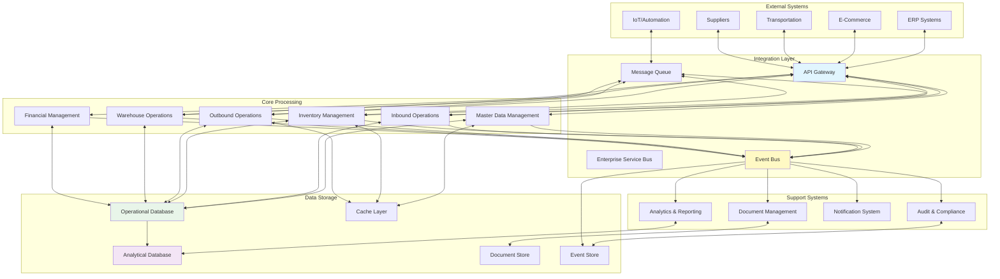

### 2.2 Key Data Flow Patterns

#### 2.2.1 Master Data Distribution

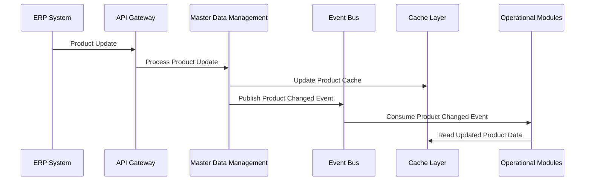

#### 2.2.2 Inbound Processing Flow

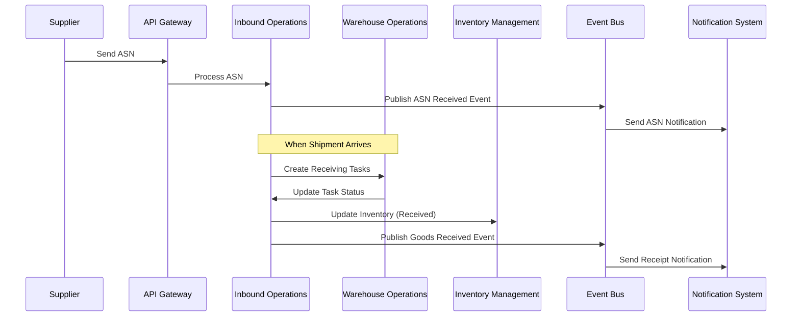

#### 2.2.3 Outbound Processing Flow

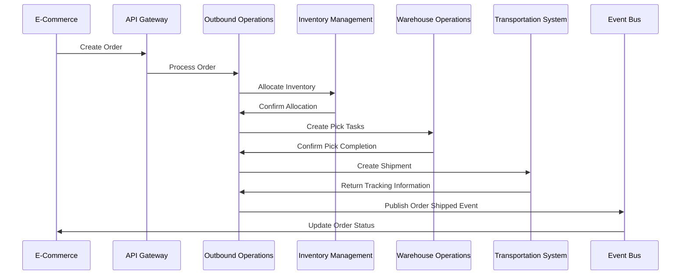

#### 2.2.4 Inventory Movement Flow

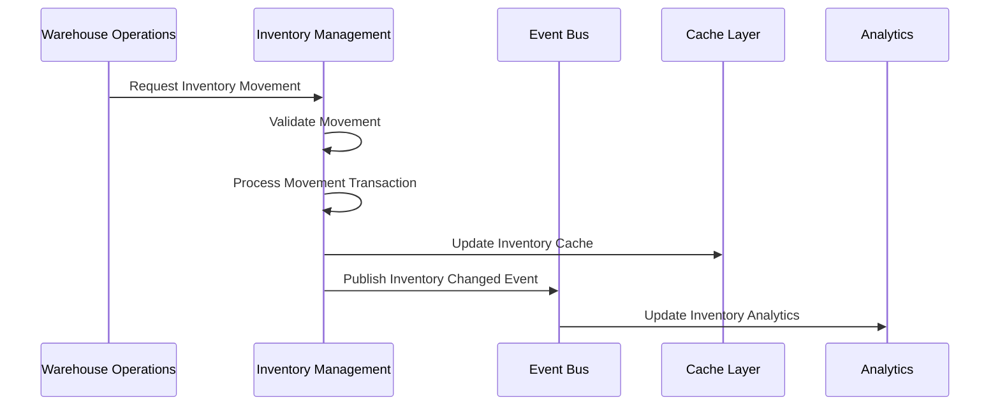

## 3. Module-Specific Data Flows

### 3.1 Master Data Management Data Flows

#### 3.1.1 Product Data Flow

| Source | Destination | Data Elements | Flow Type | Trigger | Frequency |
|--------|-------------|---------------|-----------|---------|-----------|
| ERP | MDM | Product Master | Sync | Product Creation/Update | Real-time/Scheduled |
| MDM | All Modules | Product Reference Data | Publish | Product Change | Real-time |
| MDM | E-Commerce | Product Catalog | Export | Product Publication | Scheduled |
| MDM | Analytics | Product Hierarchy | Export | Reporting Needs | Scheduled |
| Supplier | MDM | Product Attributes | Import | Catalog Update | Scheduled |

**Data Flow Diagram:**

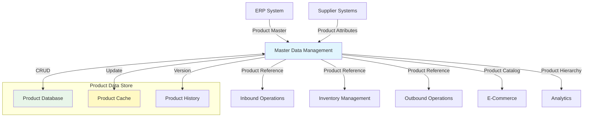

#### 3.1.2 Location Data Flow

| Source | Destination | Data Elements | Flow Type | Trigger | Frequency |
|--------|-------------|---------------|-----------|---------|-----------|
| MDM | All Modules | Location Hierarchy | Publish | Location Change | Real-time |
| MDM | WOP | Location Attributes | Publish | Attribute Change | Real-time |
| MDM | Analytics | Location Structure | Export | Reporting Needs | Scheduled |
| WOP | MDM | Location Status | Update | Status Change | Real-time |
| WOP | MDM | Location Utilization | Update | Periodic Update | Scheduled |

**Data Flow Diagram:**

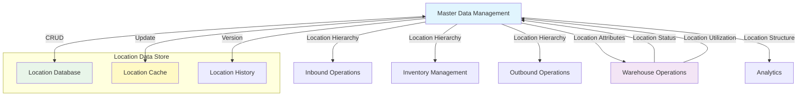

### 3.2 Inbound Operations Data Flows

#### 3.2.1 ASN Processing Flow

| Source | Destination | Data Elements | Flow Type | Trigger | Frequency |
|--------|-------------|---------------|-----------|---------|-----------|
| Supplier | INB | ASN Data | Import | ASN Creation | Real-time |
| INB | MDM | Supplier Validation | Query | ASN Processing | Real-time |
| INB | MDM | Product Validation | Query | ASN Processing | Real-time |
| INB | WOP | Receiving Tasks | Create | ASN Approval | Real-time |
| INB | Notification | ASN Status | Notify | Status Change | Real-time |
| INB | Document | ASN Documents | Generate | ASN Processing | Real-time |

**Data Flow Diagram:**

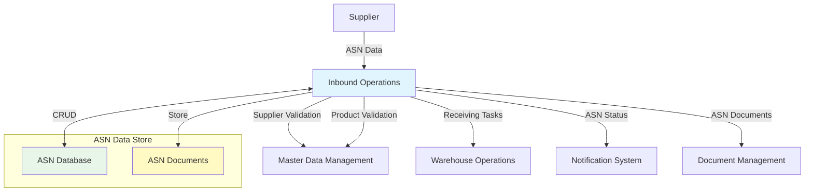

#### 3.2.2 Receiving Flow

| Source | Destination | Data Elements | Flow Type | Trigger | Frequency |
|--------|-------------|---------------|-----------|---------|-----------|
| WOP | INB | Receipt Confirmation | Update | Receipt Completion | Real-time |
| INB | INV | Received Inventory | Create | Receipt Confirmation | Real-time |
| INB | QC | Quality Inspection | Request | Receipt Completion | Real-time |
| INB | FIN | Receipt Value | Report | Receipt Confirmation | Real-time |
| INB | ERP | Goods Receipt | Notify | Receipt Confirmation | Real-time |
| INB | Analytics | Receipt Metrics | Report | Receipt Completion | Real-time |

**Data Flow Diagram:**

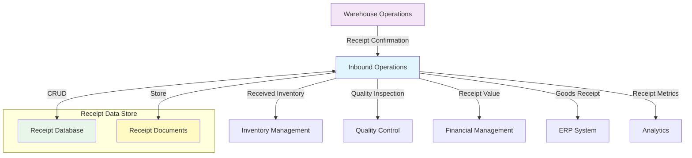

### 3.3 Inventory Management Data Flows

#### 3.3.1 Inventory Transaction Flow

| Source | Destination | Data Elements | Flow Type | Trigger | Frequency |
|--------|-------------|---------------|-----------|---------|-----------|
| INB | INV | Receipt Transactions | Create | Goods Receipt | Real-time |
| OUT | INV | Issue Transactions | Create | Order Shipment | Real-time |
| WOP | INV | Movement Transactions | Create | Inventory Move | Real-time |
| INV | CACHE | Inventory Levels | Update | Transaction Processing | Real-time |
| INV | Analytics | Inventory Metrics | Report | Transaction Processing | Real-time |
| INV | ERP | Inventory Sync | Export | Transaction Processing | Scheduled |
| INV | E-Commerce | Available Inventory | Export | Inventory Change | Near Real-time |

**Data Flow Diagram:**

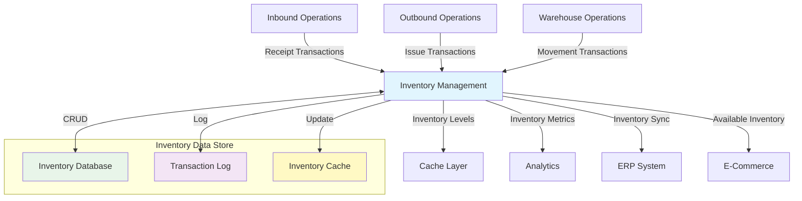

#### 3.3.2 Inventory Allocation Flow

| Source | Destination | Data Elements | Flow Type | Trigger | Frequency |
|--------|-------------|---------------|-----------|---------|-----------|
| OUT | INV | Allocation Request | Request | Order Creation | Real-time |
| INV | INV | Allocation Rules | Process | Allocation Request | Real-time |
| INV | OUT | Allocation Result | Response | Allocation Completion | Real-time |
| INV | CACHE | Reserved Inventory | Update | Allocation Completion | Real-time |
| INV | Analytics | Allocation Metrics | Report | Allocation Completion | Real-time |

**Data Flow Diagram:**

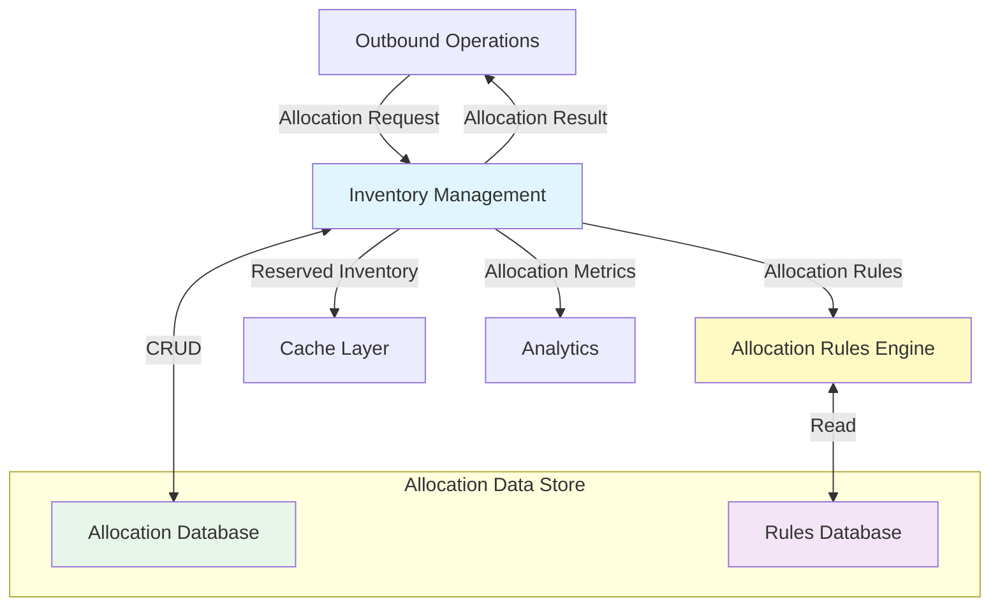

### 3.4 Outbound Operations Data Flows

#### 3.4.1 Order Processing Flow

| Source | Destination | Data Elements | Flow Type | Trigger | Frequency |
|--------|-------------|---------------|-----------|---------|-----------|
| E-Commerce | OUT | Sales Order | Create | Order Placement | Real-time |
| OUT | MDM | Customer Validation | Query | Order Processing | Real-time |
| OUT | MDM | Product Validation | Query | Order Processing | Real-time |
| OUT | INV | Inventory Allocation | Request | Order Acceptance | Real-time |
| OUT | WOP | Picking Tasks | Create | Order Release | Real-time |
| OUT | Notification | Order Status | Notify | Status Change | Real-time |
| OUT | Document | Order Documents | Generate | Order Processing | Real-time |

**Data Flow Diagram:**

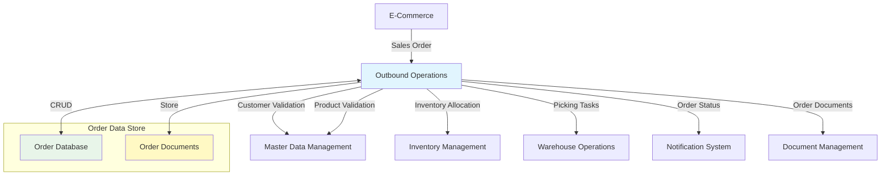

#### 3.4.2 Shipping Flow

| Source | Destination | Data Elements | Flow Type | Trigger | Frequency |
|--------|-------------|---------------|-----------|---------|-----------|
| WOP | OUT | Packing Confirmation | Update | Packing Completion | Real-time |
| OUT | TMS | Shipment Request | Create | Ready to Ship | Real-time |
| TMS | OUT | Shipping Labels | Return | Shipment Creation | Real-time |
| TMS | OUT | Tracking Information | Return | Shipment Creation | Real-time |
| OUT | INV | Shipped Inventory | Update | Shipment Confirmation | Real-time |
| OUT | FIN | Shipping Charges | Report | Shipment Confirmation | Real-time |
| OUT | E-Commerce | Shipment Status | Notify | Shipment Confirmation | Real-time |
| OUT | Analytics | Shipping Metrics | Report | Shipment Completion | Real-time |

**Data Flow Diagram:**

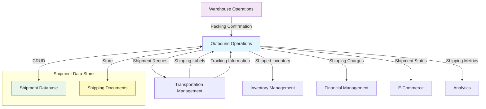

### 3.5 Warehouse Operations Data Flows

#### 3.5.1 Task Management Flow

| Source | Destination | Data Elements | Flow Type | Trigger | Frequency |
|--------|-------------|---------------|-----------|---------|-----------|
| INB | WOP | Receiving Tasks | Create | ASN Processing | Real-time |
| OUT | WOP | Picking Tasks | Create | Order Release | Real-time |
| INV | WOP | Replenishment Tasks | Create | Low Stock | Real-time |
| WOP | WOP | Task Assignment | Process | Task Creation | Real-time |
| WOP | Mobile | Task Instructions | Deliver | Task Assignment | Real-time |
| Mobile | WOP | Task Confirmation | Update | Task Completion | Real-time |
| WOP | Analytics | Task Metrics | Report | Task Completion | Real-time |

**Data Flow Diagram:**

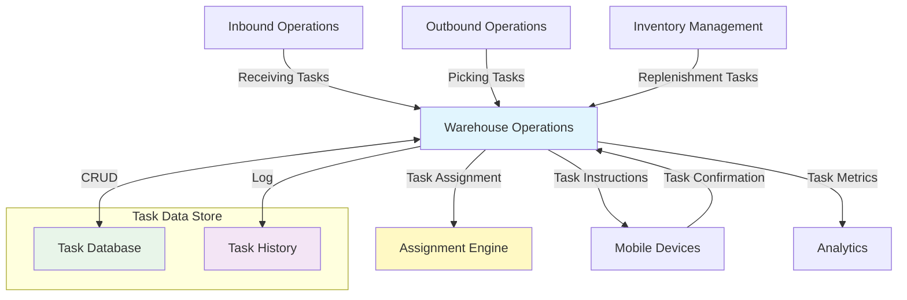

#### 3.5.2 Labor Management Flow

| Source | Destination | Data Elements | Flow Type | Trigger | Frequency |
|--------|-------------|---------------|-----------|---------|-----------|
| MDM | WOP | Employee Data | Reference | Employee Update | Real-time |
| WOP | WOP | Labor Standards | Reference | Task Planning | Real-time |
| Mobile | WOP | Time Tracking | Capture | Task Execution | Real-time |
| WOP | WOP | Performance Calculation | Process | Shift Completion | Real-time |
| WOP | FIN | Labor Costs | Report | Period Close | Scheduled |
| WOP | Analytics | Labor Metrics | Report | Shift Completion | Real-time |

**Data Flow Diagram:**

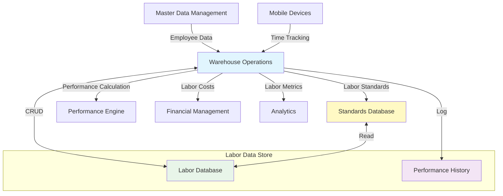

### 3.6 Financial & Billing Data Flows

#### 3.6.1 Cost Tracking Flow

| Source | Destination | Data Elements | Flow Type | Trigger | Frequency |
|--------|-------------|---------------|-----------|---------|-----------|
| INB | FIN | Receiving Costs | Report | Receipt Completion | Real-time |
| OUT | FIN | Shipping Costs | Report | Shipment Completion | Real-time |
| WOP | FIN | Labor Costs | Report | Shift Completion | Scheduled |
| WOP | FIN | Equipment Costs | Report | Usage Recording | Scheduled |
| INV | FIN | Storage Costs | Calculate | Period Close | Scheduled |
| FIN | FIN | Cost Allocation | Process | Period Close | Scheduled |
| FIN | ERP | GL Entries | Export | Period Close | Scheduled |
| FIN | Analytics | Cost Metrics | Report | Period Close | Scheduled |

**Data Flow Diagram:**

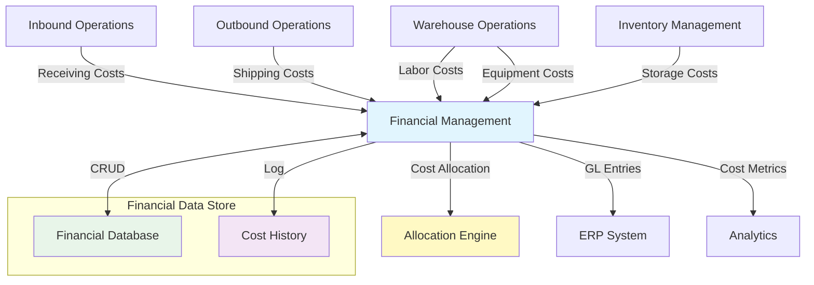

#### 3.6.2 Billing Flow

| Source | Destination | Data Elements | Flow Type | Trigger | Frequency |
|--------|-------------|---------------|-----------|---------|-----------|
| INB | FIN | Billable Activities | Record | Activity Completion | Real-time |
| OUT | FIN | Billable Activities | Record | Activity Completion | Real-time |
| INV | FIN | Storage Billing | Calculate | Period Close | Scheduled |
| FIN | FIN | Rate Application | Process | Billing Run | Scheduled |
| FIN | FIN | Invoice Generation | Process | Billing Run | Scheduled |
| FIN | Document | Invoice Documents | Generate | Invoice Creation | Real-time |
| FIN | ERP | AR Entries | Export | Invoice Creation | Scheduled |
| FIN | Customer | Invoice Delivery | Send | Invoice Finalization | Scheduled |

**Data Flow Diagram:**

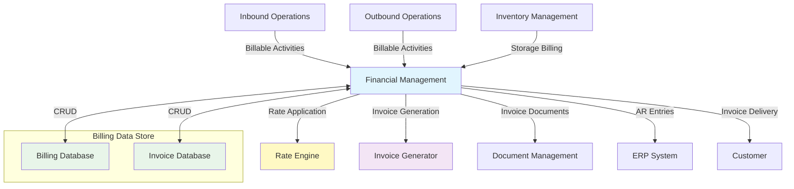

### 3.7 Analytics & Reporting Data Flows

#### 3.7.1 Operational Data Collection Flow

| Source | Destination | Data Elements | Flow Type | Trigger | Frequency |
|--------|-------------|---------------|-----------|---------|-----------|
| INB | ANA | Inbound Metrics | Report | Activity Completion | Real-time |
| INV | ANA | Inventory Metrics | Report | Status Change | Real-time |
| OUT | ANA | Outbound Metrics | Report | Activity Completion | Real-time |
| WOP | ANA | Operational Metrics | Report | Activity Completion | Real-time |
| FIN | ANA | Financial Metrics | Report | Period Close | Scheduled |
| ANA | ANA | Data Aggregation | Process | Scheduled | Scheduled |
| ANA | ANA | KPI Calculation | Process | Scheduled | Scheduled |
| ANA | Dashboard | Visualization Data | Deliver | User Request | On-demand |

**Data Flow Diagram:**

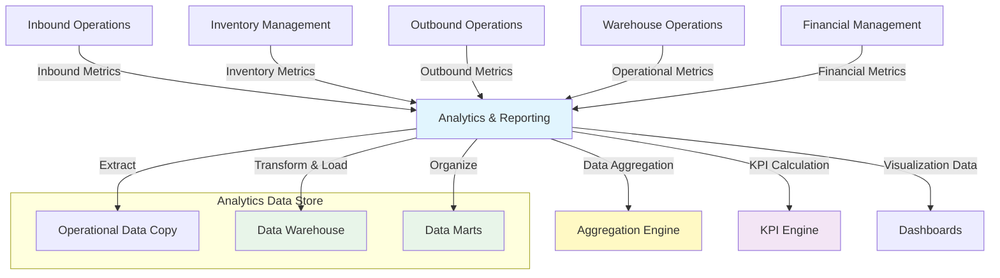

#### 3.7.2 Reporting Flow

| Source | Destination | Data Elements | Flow Type | Trigger | Frequency |
|--------|-------------|---------------|-----------|---------|-----------|
| ANA | ANA | Report Generation | Process | Scheduled/On-demand | Varies |
| ANA | Document | Report Documents | Generate | Report Completion | Real-time |
| ANA | User | Report Delivery | Send | Report Completion | Real-time |
| ANA | External | Data Export | Extract | User Request | On-demand |
| ANA | BI Tools | Data Connection | Provide | User Request | On-demand |
| ANA | Notification | Alert Generation | Trigger | Threshold Breach | Real-time |

**Data Flow Diagram:**

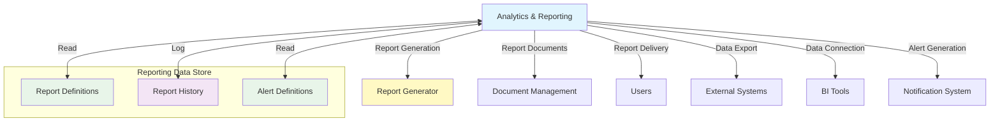

## 4. Cross-Cutting Data Flows

### 4.1 Notification & Alerting Data Flows

| Source | Destination | Data Elements | Flow Type | Trigger | Frequency |
|--------|-------------|---------------|-----------|---------|-----------|
| All Modules | NOT | Event Notifications | Publish | Business Events | Real-time |
| ANA | NOT | Threshold Alerts | Trigger | Threshold Breach | Real-time |
| NOT | NOT | Notification Rules | Process | Notification Event | Real-time |
| NOT | User | User Notifications | Deliver | Rule Matching | Real-time |
| NOT | External | External Notifications | Send | Rule Matching | Real-time |
| NOT | Mobile | Push Notifications | Send | Rule Matching | Real-time |
| NOT | Email | Email Notifications | Send | Rule Matching | Real-time |
| NOT | SMS | SMS Notifications | Send | Rule Matching | Real-time |

**Data Flow Diagram:**

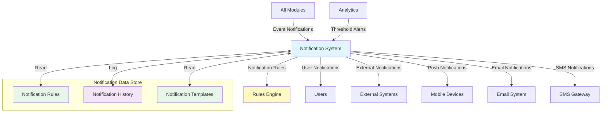

### 4.2 Document & Label Management Data Flows

| Source | Destination | Data Elements | Flow Type | Trigger | Frequency |
|--------|-------------|---------------|-----------|---------|-----------|
| All Modules | DOC | Document Requests | Request | Business Events | Real-time |
| DOC | DOC | Template Application | Process | Document Request | Real-time |
| DOC | DOC | Document Generation | Process | Template Application | Real-time |
| DOC | Storage | Document Storage | Store | Document Generation | Real-time |
| DOC | User | Document Delivery | Deliver | Document Generation | Real-time |
| DOC | Printer | Label Printing | Print | Label Generation | Real-time |
| DOC | External | Document Sharing | Share | User Request | On-demand |
| DOC | Archive | Document Archiving | Archive | Retention Policy | Scheduled |

**Data Flow Diagram:**

```mermaid
graph TD
    MODULES[All Modules] -->|Document Requests| DOC[Document Management]
    DOC -->|Template Application| TEMPL[Template Engine]
    DOC -->|Document Generation| GEN[Generation Engine]
    DOC -->|Document Storage| STORE[Document Storage]
    DOC -->|Document Delivery| USER[Users]
    DOC -->|Label Printing| PRINT[Printers]
    DOC -->|Document Sharing| EXT[External Systems]
    DOC -->|Document Archiving| ARCH[Archive]
    
    subgraph "Document Data Store"
        DOC_TEMPL[Document Templates]
        DOC_STORE[Document Repository]
        DOC_META[Document Metadata]
    end
    
    DOC <-->|Read| DOC_TEMPL
    DOC <-->|CRUD| DOC_STORE
    DOC <-->|CRUD| DOC_META
    
    style DOC fill:#e1f5fe
    style TEMPL fill:#fff9c4
    style GEN fill:#f3e5f5
    style DOC_TEMPL fill:#e8f5e9
    style DOC_STORE fill:#e8f5e9
    style DOC_META fill:#e8f5e9
```

### 4.3 Audit & Compliance Data Flows

| Source | Destination | Data Elements | Flow Type | Trigger | Frequency |
|--------|-------------|---------------|-----------|---------|-----------|
| All Modules | AUD | Audit Events | Log | User/System Actions | Real-time |
| AUD | AUD | Audit Processing | Process | Audit Event | Real-time |
| AUD | Storage | Audit Storage | Store | Audit Processing | Real-time |
| AUD | AUD | Compliance Checking | Process | Scheduled/On-demand | Varies |
| AUD | Notification | Compliance Alerts | Trigger | Compliance Issue | Real-time |
| AUD | Report | Audit Reports | Generate | User Request | On-demand |
| AUD | External | Compliance Reporting | Export | Regulatory Requirement | Scheduled |
| AUD | Archive | Audit Archiving | Archive | Retention Policy | Scheduled |

**Data Flow Diagram:**

```mermaid
graph TD
    MODULES[All Modules] -->|Audit Events| AUD[Audit & Compliance]
    AUD -->|Audit Processing| PROC[Processing Engine]
    AUD -->|Audit Storage| STORE[Audit Storage]
    AUD -->|Compliance Checking| COMP[Compliance Engine]
    AUD -->|Compliance Alerts| NOT[Notification System]
    AUD -->|Audit Reports| REP[Reporting]
    AUD -->|Compliance Reporting| EXT[External Systems]
    AUD -->|Audit Archiving| ARCH[Archive]
    
    subgraph "Audit Data Store"
        AUDIT_LOG[Audit Log]
        COMP_RULES[Compliance Rules]
        AUDIT_META[Audit Metadata]
    end
    
    AUD <-->|CRUD| AUDIT_LOG
    AUD <-->|Read| COMP_RULES
    AUD <-->|CRUD| AUDIT_META
    
    style AUD fill:#e1f5fe
    style PROC fill:#fff9c4
    style COMP fill:#f3e5f5
    style AUDIT_LOG fill:#e8f5e9
    style COMP_RULES fill:#e8f5e9
    style AUDIT_META fill:#e8f5e9
```

## 5. Data Storage Architecture

### 5.1 Database Architecture

```mermaid
graph TD
    subgraph "Operational Data Store"
        OLTP[OLTP Database]
        CACHE[Cache Layer]
        QUEUE[Message Queue]
        EVENT_STORE[Event Store]
    end
    
    subgraph "Analytical Data Store"
        STAGING[Data Staging]
        DW[Data Warehouse]
        MART[Data Marts]
        OLAP[OLAP Cubes]
    end
    
    subgraph "Document Store"
        DOC_REPO[Document Repository]
        MEDIA[Media Storage]
        TEMPLATE[Template Storage]
    end
    
    subgraph "Archive"
        ARCH_DATA[Archived Data]
        ARCH_DOC[Archived Documents]
        ARCH_LOG[Archived Logs]
    end
    
    OLTP -->|Extract| STAGING
    STAGING -->|Transform| DW
    DW -->|Organize| MART
    MART -->|Aggregate| OLAP
    
    OLTP -->|Age-out| ARCH_DATA
    DOC_REPO -->|Age-out| ARCH_DOC
    EVENT_STORE -->|Age-out| ARCH_LOG
    
    style OLTP fill:#e1f5fe
    style CACHE fill:#fff9c4
    style DW fill:#e8f5e9
    style OLAP fill:#f3e5f5
    style DOC_REPO fill:#e0f7fa
    style ARCH_DATA fill:#fff3e0
```

### 5.2 Data Retention Strategy

| Data Category | Online Storage | Warm Storage | Archive Storage | Total Retention |
|---------------|----------------|--------------|-----------------|-----------------|
| Transactional Data | 3-6 months | 1-2 years | 7-10 years | 10+ years |
| Master Data | Current + History | All versions | Obsolete versions | Indefinite |
| Inventory Data | 6-12 months | 2-3 years | 7+ years | 10+ years |
| Operational Metrics | 1-3 months | 1 year | 7+ years | 8+ years |
| Financial Data | Current fiscal year | 3-7 years | 10+ years | 10+ years |
| Audit Logs | 3-6 months | 1-2 years | 8+ years | 10+ years |
| Documents | Active | 1-3 years | 7+ years | 10+ years |
| System Logs | 1-4 weeks | 3-6 months | 1-3 years | 3+ years |

### 5.3 Data Access Patterns

| Access Pattern | Use Cases | Implementation | Performance Considerations |
|----------------|-----------|----------------|---------------------------|
| **CRUD Operations** | Master data management, Transaction processing | Direct database access, API layer | Indexing, Transaction isolation, Concurrency control |
| **Bulk Operations** | Data imports, Mass updates, Batch processing | Batch APIs, ETL processes | Chunking, Parallel processing, Transaction management |
| **Real-time Queries** | Inventory lookup, Order status, Availability check | Cached data, Optimized queries | Caching strategy, Query optimization, Denormalization |
| **Analytical Queries** | Reporting, Dashboards, Data analysis | Data warehouse, OLAP cubes | Star schema, Aggregation tables, Materialized views |
| **Full-text Search** | Document search, Product search, Knowledge base | Search engine integration | Indexing strategy, Relevance tuning, Search optimization |
| **Temporal Queries** | Historical analysis, Audit trail, Version history | Temporal tables, Event sourcing | Time-based partitioning, Archiving strategy |

## 6. Data Flow Implementation Strategy

### 6.1 Implementation Phases

#### 6.1.1 Phase 1: Core Data Flows (Months 1-3)

1. **Master Data Foundation**
   - Implement master data management flows
   - Establish reference data distribution
   - Create data validation processes
   - Set up basic event publishing

2. **Transactional Core**
   - Implement inventory transaction flows
   - Create basic inbound/outbound flows
   - Establish audit logging
   - Set up document generation

3. **Integration Foundation**
   - Implement API gateway
   - Create basic ERP integration flows
   - Establish event bus
   - Set up message queues

#### 6.1.2 Phase 2: Operational Data Flows (Months 4-9)

1. **Inbound Process Flows**
   - Implement complete ASN processing
   - Create receiving workflows
   - Establish quality control flows
   - Set up putaway processes

2. **Inventory Management Flows**
   - Implement allocation engine
   - Create inventory movement flows
   - Establish cycle counting processes
   - Set up lot/serial tracking

3. **Warehouse Operations Flows**
   - Implement task management
   - Create labor tracking
   - Establish equipment monitoring
   - Set up performance metrics

#### 6.1.3 Phase 3: Advanced Data Flows (Months 10-15)

1. **Outbound Process Flows**
   - Implement order management
   - Create picking/packing workflows
   - Establish shipping processes
   - Set up carrier integration

2. **Financial Data Flows**
   - Implement cost tracking
   - Create billing processes
   - Establish financial reporting
   - Set up GL integration

3. **Analytics Data Flows**
   - Implement data warehouse
   - Create reporting framework
   - Establish KPI calculations
   - Set up dashboards

#### 6.1.4 Phase 4: Optimization & Extension (Months 16-24)

1. **Advanced Integration Flows**
   - Implement e-commerce integration
   - Create marketplace connections
   - Establish IoT data flows
   - Set up advanced ERP integration

2. **Optimization Flows**
   - Implement predictive analytics
   - Create optimization algorithms
   - Establish machine learning pipelines
   - Set up decision support systems

3. **Compliance & Security Flows**
   - Implement advanced audit trails
   - Create compliance reporting
   - Establish security monitoring
   - Set up data privacy controls

### 6.2 Technical Implementation Considerations

#### 6.2.1 Event-Driven Architecture Implementation

1. **Event Schema Design**
   - Standardized event structure
   - Event versioning strategy
   - Event metadata requirements
   - Event payload design

2. **Event Processing Infrastructure**
   - Message broker selection (Kafka, RabbitMQ)
   - Topic/queue design
   - Consumer group strategy
   - Dead letter handling

3. **Event Sourcing Patterns**
   - Event store implementation
   - State reconstruction
   - Snapshotting strategy
   - Event replay capabilities

4. **Event Monitoring**
   - Event flow visualization
   - Throughput monitoring
   - Latency tracking
   - Error detection

#### 6.2.2 API Implementation Strategy

1. **API Design**
   - RESTful resource modeling
   - GraphQL schema design
   - Versioning strategy
   - Error handling standardization

2. **API Gateway Implementation**
   - Routing configuration
   - Authentication integration
   - Rate limiting setup
   - Request/response transformation

3. **API Documentation**
   - OpenAPI/Swagger implementation
   - Interactive documentation
   - Code sample generation
   - API changelog maintenance

4. **API Monitoring**
   - Usage analytics
   - Performance tracking
   - Error rate monitoring
   - SLA compliance

#### 6.2.3 Data Consistency Implementation

1. **Transaction Boundaries**
   - Service transaction design
   - Distributed transaction handling
   - Saga pattern implementation
   - Compensation transaction design

2. **Caching Strategy**
   - Cache invalidation approach
   - Cache synchronization
   - Cache hierarchy
   - Cache warming strategy

3. **Conflict Resolution**
   - Optimistic concurrency control
   - Last-writer-wins strategy
   - Merge resolution
   - Conflict notification

4. **Data Reconciliation**
   - Periodic reconciliation processes
   - Discrepancy detection
   - Automated correction
   - Manual resolution workflow

### 6.3 Data Flow Monitoring & Management

1. **Flow Monitoring**
   - End-to-end transaction tracking
   - Flow visualization
   - Throughput dashboards
   - Latency monitoring

2. **Data Quality Monitoring**
   - Data validation metrics
   - Error rate tracking
   - Data completeness checking
   - Consistency verification

3. **Performance Optimization**
   - Bottleneck identification
   - Caching effectiveness
   - Query optimization
   - Resource utilization

4. **Flow Governance**
   - Flow documentation
   - Change impact analysis
   - Version control
   - Dependency mapping

## 7. Data Security & Compliance

### 7.1 Data Security Architecture

```mermaid
graph TD
    subgraph "Security Layers"
        AUTH[Authentication]
        AUTHZ[Authorization]
        ENCRYPT[Encryption]
        AUDIT[Audit Logging]
        MASK[Data Masking]
    end
    
    subgraph "Data Classification"
        PUBLIC[Public Data]
        INTERNAL[Internal Data]
        CONFIDENTIAL[Confidential Data]
        RESTRICTED[Restricted Data]
    end
    
    subgraph "Access Controls"
        RBAC[Role-Based Access]
        ABAC[Attribute-Based Access]
        CONTEXT[Contextual Access]
    end
    
    AUTH --> AUTHZ
    AUTHZ --> RBAC
    AUTHZ --> ABAC
    AUTHZ --> CONTEXT
    
    RBAC --> PUBLIC
    RBAC --> INTERNAL
    ABAC --> CONFIDENTIAL
    CONTEXT --> RESTRICTED
    
    CONFIDENTIAL --> ENCRYPT
    RESTRICTED --> ENCRYPT
    RESTRICTED --> MASK
    
    PUBLIC --> AUDIT
    INTERNAL --> AUDIT
    CONFIDENTIAL --> AUDIT
    RESTRICTED --> AUDIT
    
    style AUTH fill:#e1f5fe
    style AUTHZ fill:#fff9c4
    style ENCRYPT fill:#e8f5e9
    style AUDIT fill:#f3e5f5
    style MASK fill:#fff3e0
```

### 7.2 Data Privacy Implementation

1. **PII Identification & Classification**
   - Data discovery processes
   - PII classification rules
   - Automated scanning
   - Classification maintenance

2. **Privacy Controls**
   - Data minimization
   - Purpose limitation
   - Storage limitation
   - Access restriction

3. **Consent Management**
   - Consent capture
   - Consent tracking
   - Consent withdrawal
   - Consent verification

4. **Data Subject Rights**
   - Access request handling
   - Rectification process
   - Erasure workflow
   - Portability support

### 7.3 Compliance Requirements

| Regulation | Data Flow Requirements | Implementation Approach |
|------------|------------------------|-------------------------|
| **GDPR** | Lawful basis for processing, Data minimization, Purpose limitation, Storage limitation, Integrity and confidentiality | PII identification, Consent management, Data subject rights processes, Data protection impact assessments |
| **CCPA/CPRA** | Notice at collection, Right to know, Right to delete, Right to opt-out, Right to non-discrimination | Consumer rights portal, Data inventory, Processing records, Third-party data sharing controls |
| **HIPAA** (if applicable) | PHI protection, Minimum necessary standard, Technical safeguards, Administrative safeguards, Physical safeguards | PHI identification, Access controls, Encryption, Audit controls, Integrity controls |
| **PCI DSS** (if applicable) | Cardholder data protection, Secure networks, Access control, Monitoring and testing, Information security policy | Cardholder data environment, Network segmentation, Encryption, Vulnerability management, Security awareness |
| **SOX** (if applicable) | Financial data integrity, Access controls, Audit trails, Change management, Segregation of duties | Financial data flows, Approval workflows, Transaction logging, Change control, Role separation |

## 8. Future State Data Flow Architecture

### 8.1 Advanced Data Flow Capabilities

1. **Machine Learning Integration**
   - Predictive inventory management
   - Demand forecasting
   - Anomaly detection
   - Recommendation engines
   - Optimization algorithms

2. **Real-time Analytics**
   - Stream processing
   - Complex event processing
   - Real-time dashboards
   - Operational intelligence
   - Predictive alerts

3. **Advanced Integration Patterns**
   - API composition
   - Backend for frontend (BFF)
   - GraphQL federation
   - Event collaboration
   - Choreography vs. orchestration

4. **Blockchain Integration**
   - Supply chain traceability
   - Smart contracts
   - Immutable audit trails
   - Decentralized identity
   - Tokenized assets

### 8.2 Data Mesh Architecture

1. **Domain-Oriented Data Ownership**
   - Domain-specific data products
   - Decentralized data governance
   - Self-service data infrastructure
   - Federated computational governance
   - Domain-specific data quality

2. **Data as a Product**
   - Discoverable data products
   - Self-describing data
   - Secure and governed access
   - Trustworthy and reliable data
   - Value-oriented metrics

3. **Self-Service Data Platform**
   - Standardized tooling
   - Automated data pipelines
   - Reusable data components
   - Simplified data onboarding
   - Democratized data access

4. **Federated Governance**
   - Global standards
   - Local implementation
   - Automated policy enforcement
   - Distributed accountability
   - Centralized monitoring