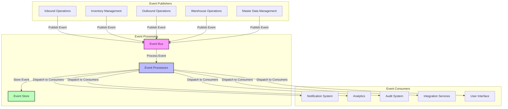
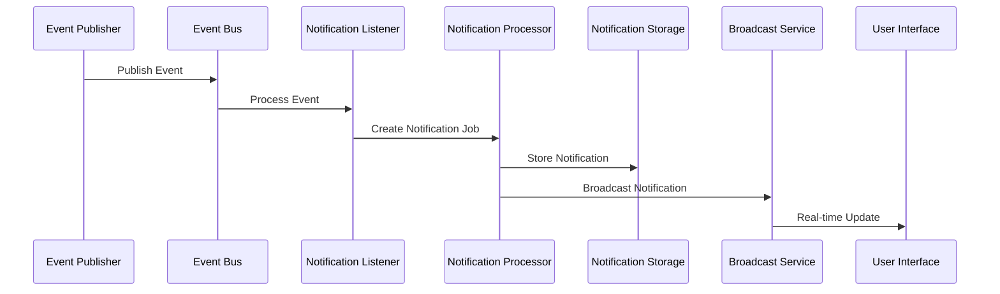

# Event-Driven Architecture Implementation

This document outlines the implementation of the event-driven architecture in ShweLogixWMS, detailing the components, patterns, and best practices used.

## 1. Overview

The ShweLogixWMS system implements an event-driven architecture to enable loose coupling between components, asynchronous processing, and real-time updates across the system. This architecture allows the system to scale efficiently and respond to changes in state in a consistent manner.

### 1.1 Key Components

1. **Event Publishers**: System components that generate events when state changes occur
2. **Event Bus**: Central message broker for distributing events
3. **Event Consumers**: Components that listen for and react to events
4. **Event Store**: Persistent storage of events for auditing and replay
5. **Event Processors**: Background workers that process events asynchronously

### 1.2 Event Flow



## 2. Event Schema

### 2.1 Base Event Structure

All events in the system inherit from a base event structure that includes:

```json
{
  "id": "uuid-string",
  "name": "event.name",
  "timestamp": "ISO-8601 timestamp",
  "version": "1.0",
  "source": "component-name",
  "payload": {
    // Event-specific data
  }
}
```

### 2.2 Event Types

The system defines several categories of events:

1. **Domain Events**: Represent business-significant occurrences (e.g., `order.created`, `inventory.adjusted`)
2. **Integration Events**: Used for cross-system communication (e.g., `erp.sync.completed`)
3. **System Events**: Internal technical events (e.g., `system.health.alert`)
4. **Notification Events**: Events that trigger user notifications (e.g., `task.assigned`)

### 2.3 Event Versioning

Events are versioned to allow for schema evolution:

- Version is included in the event metadata
- Consumers can handle multiple versions of the same event
- Schema registry maintains event definitions

## 3. Implementation Details

### 3.1 Event Publishing

Events are published using the `EventService`:

```php
// Example of publishing an event
$event = new InventoryAdjustedEvent($product, $quantity, $reason);
EventService::dispatch($event);
```

The `EventService` handles:
- Event enrichment (adding metadata)
- Event validation
- Dispatching to the message broker
- Local event handling

### 3.2 Event Processing

Events are processed asynchronously using Laravel jobs:

```php
// ProcessEventJob handles the asynchronous processing of events
class ProcessEventJob implements ShouldQueue
{
    use Dispatchable, InteractsWithQueue, Queueable, SerializesModels;

    protected $event;

    public function __construct(BaseEvent $event)
    {
        $this->event = $event;
    }

    public function handle()
    {
        // Process the event
        EventLogService::storeEvent($this->event);
        BroadcastService::broadcastEvent($this->event);
    }
}
```

### 3.3 Event Consumption

Events are consumed by registering listeners in the `EventServiceProvider`:

```php
protected $listen = [
    'App\Events\Inventory\InventoryAdjustedEvent' => [
        'App\Listeners\Inventory\UpdateInventoryMetricsListener',
        'App\Listeners\Notification\InventoryAlertListener',
    ],
];
```

Listeners can:
- Update system state
- Trigger notifications
- Generate reports
- Integrate with external systems

### 3.4 Event Broadcasting

Real-time updates are delivered to the frontend using Laravel Echo and WebSockets:

```php
// BroadcastService handles sending events to the frontend
class BroadcastService
{
    public static function broadcastEvent(BaseEvent $event, $channel = null)
    {
        $channel = $channel ?? self::determineChannel($event);
        
        broadcast(new EventBroadcast($event, $channel))->toOthers();
    }
}
```

## 4. Notification System

The notification system is a key consumer of events, transforming relevant events into user notifications.

### 4.1 Notification Flow



### 4.2 Notification Types

The system supports various notification types:

1. **Task Notifications**: Alerts about task assignments and updates
2. **Threshold Alerts**: Notifications when system metrics cross thresholds
3. **Approval Notifications**: Requests for user approvals
4. **System Notifications**: Alerts about system status and issues
5. **Information Notifications**: General informational updates

### 4.3 Notification Delivery

Notifications are delivered through multiple channels:

- **In-app**: Real-time notifications in the user interface
- **Email**: Configurable email notifications for important events
- **Mobile Push**: Notifications to the mobile application
- **SMS**: Critical alerts via SMS (configurable)

## 5. Monitoring and Management

### 5.1 Event Monitoring Dashboard

The system includes an event monitoring dashboard that provides:

- Event throughput metrics
- Error rates and details
- Processing latency
- Event backlog information
- Event search and filtering

### 5.2 Event Replay

For recovery and debugging, the system supports event replay:

- Events can be replayed from the event store
- Replay can be targeted to specific consumers
- Replay can be filtered by time range or event type

### 5.3 Dead Letter Queue

Failed event processing is handled through a dead letter queue:

- Events that fail processing are moved to a dead letter queue
- Administrators can review and retry or discard failed events
- Automatic retry policies can be configured

## 6. Best Practices

### 6.1 Event Design Guidelines

- Events should represent facts that have happened, not commands
- Event names should use past tense verbs (e.g., `order.created` not `create.order`)
- Events should be self-contained with all necessary context
- Events should be immutable once published
- Events should be idempotent for consumers

### 6.2 Performance Considerations

- Use appropriate queue workers and scaling for event processing
- Implement backpressure mechanisms for high-volume event streams
- Monitor queue depths and processing latency
- Use batch processing for high-frequency events when appropriate
- Implement circuit breakers for dependent systems

### 6.3 Testing Strategies

- Unit test event publishers and consumers independently
- Use event mocks for testing dependent components
- Implement integration tests for event flows
- Test event schema compatibility across versions
- Simulate event replay scenarios

## 7. Future Enhancements

- Implement event sourcing for critical domains
- Add event schema registry and validation
- Enhance event visualization and monitoring
- Implement advanced event correlation
- Add machine learning for anomaly detection in event patterns