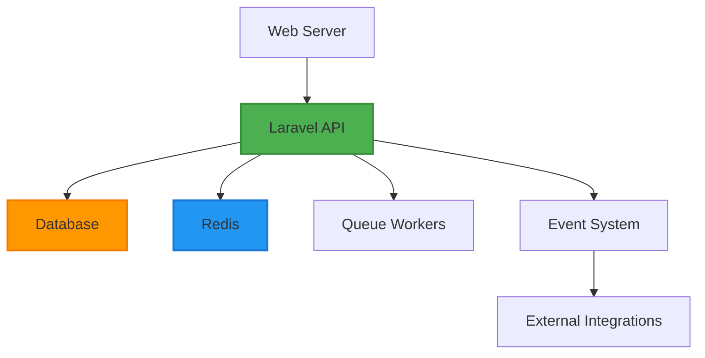

# ShweLogix WMS Consolidated Operations Documentation

## Table of Contents
1. [System Overview](#system-overview)
2. [Deployment Guide](#deployment-guide)
3. [Monitoring & Alerting](#monitoring--alerting)
4. [Troubleshooting Guide](#troubleshooting-guide)
5. [Maintenance Procedures](#maintenance-procedures)
6. [Security Procedures](#security-procedures)
7. [Backup & Recovery](#backup--recovery)
8. [Performance Tuning](#performance-tuning)
9. [Scaling Guide](#scaling-guide)

---

## System Overview

### Architecture Components
- **Backend API**: Laravel 10.x with event-driven architecture
- **Frontend**: React 19.x with TypeScript and Material-UI
- **Database**: MariaDB with 22+ tables
- **Cache/Queue**: Redis for caching and background jobs
- **Integration Layer**: 17 external system connectors
- **Event System**: Real-time event processing with monitoring

### Service Dependencies


---

## Deployment Guide

### Prerequisites
- PHP 8.2+ with required extensions
- MariaDB 10.5+ or MySQL 8.0+
- Redis 6.0+
- Node.js 18+ (for frontend)
- Composer (PHP package manager)
- npm/yarn (Node.js package manager)

### Environment Setup

#### 1. Backend Setup
```bash
# Clone repository
git clone https://github.com/Heinsithukyaw/ShweLogixWMS.git
cd ShweLogixWMS/wms-api

# Install dependencies
composer install --optimize-autoloader

# Environment configuration
cp .env.example .env
php artisan key:generate

# Database configuration
DB_CONNECTION=mysql
DB_HOST=127.0.0.1
DB_PORT=3306
DB_DATABASE=shwelogix_wms
DB_USERNAME=your_username
DB_PASSWORD=your_password

# Redis configuration
REDIS_HOST=127.0.0.1
REDIS_PASSWORD=null
REDIS_PORT=6379

# Run migrations and seed
php artisan migrate --seed
php artisan passport:install
```

#### 2. Frontend Setup
```bash
cd ../wms-frontend-react

# Install dependencies
npm install

# Environment configuration
cp .env.example .env

# Configure API settings
VITE_API_BASE_URL=http://localhost:8000
VITE_API_TIMEOUT=30000

# Start development server
npm run dev
```

### Production Deployment

#### 1. Server Preparation
```bash
# Update system
sudo apt update && sudo apt upgrade -y

# Install required packages
sudo apt install nginx mysql-server redis-server php8.2-fpm php8.2-mysql php8.2-redis php8.2-xml php8.2-curl php8.2-mbstring php8.2-zip php8.2-gd php8.2-bcmath

# Install Node.js
curl -fsSL https://deb.nodesource.com/setup_18.x | sudo -E bash -
sudo apt-get install -y nodejs
```

#### 2. Application Deployment
```bash
# Deploy application
cd /var/www/
sudo git clone https://github.com/Heinsithukyaw/ShweLogixWMS.git
sudo chown -R www-data:www-data ShweLogixWMS
cd ShweLogixWMS/wms-api

# Configure production environment
sudo cp .env.example .env
sudo nano .env  # Configure production settings

# Install dependencies
sudo composer install --optimize-autoloader --no-dev

# Database setup
sudo mysql -u root -p -e "CREATE DATABASE shwelogix_wms_prod;"
sudo php artisan migrate --force

# Optimize for production
sudo php artisan config:cache
sudo php artisan route:cache
sudo php artisan view:cache
sudo php artisan optimize
```

#### 3. Service Configuration

##### Nginx Configuration
```nginx
# /etc/nginx/sites-available/shwelogix-wms
server {
    listen 80;
    server_name your-domain.com;
    root /var/www/ShweLogixWMS/wms-api/public;

    add_header X-Frame-Options "SAMEORIGIN";
    add_header X-Content-Type-Options "nosniff";

    index index.php;

    charset utf-8;

    location / {
        try_files $uri $uri/ /index.php?$query_string;
    }

    location = /favicon.ico { access_log off; log_not_found off; }
    location = /robots.txt  { access_log off; log_not_found off; }

    error_page 404 /index.php;

    location ~ \.php$ {
        fastcgi_pass unix:/var/run/php/php8.2-fpm.sock;
        fastcgi_param SCRIPT_FILENAME $realpath_root$fastcgi_script_name;
        include fastcgi_params;
    }

    location ~ /\.(?!well-known).* {
        deny all;
    }
}
```

##### Supervisor Configuration (Queue Workers)
```ini
# /etc/supervisor/conf.d/shwelogix-worker.conf
[program:shwelogix-worker]
process_name=%(program_name)s_%(process_num)02d
command=php /var/www/ShweLogixWMS/wms-api/artisan queue:work redis --sleep=3 --tries=3 --max-time=3600
autostart=true
autorestart=true
stopasgroup=true
killasgroup=true
user=www-data
numprocs=2
redirect_stderr=true
stdout_logfile=/var/log/shwelogix-worker.log
stopwaitsecs=3600
```

##### Cron Job Setup
```bash
# Add to crontab (crontab -e)
* * * * * cd /var/www/ShweLogixWMS/wms-api && php artisan schedule:run >> /dev/null 2>&1
```

#### 4. Start Services
```bash
# Enable and start services
sudo systemctl enable nginx
sudo systemctl enable php8.2-fpm
sudo systemctl enable redis-server
sudo systemctl enable supervisor

sudo systemctl start nginx
sudo systemctl start php8.2-fpm
sudo systemctl start redis-server
sudo systemctl start supervisor

# Start queue workers
sudo supervisorctl reread
sudo supervisorctl update
sudo supervisorctl start shwelogix-worker:*
```

---

## Monitoring & Alerting

### Health Checks

#### API Health Endpoint
```bash
# Check system health
curl -s http://your-domain.com/api/admin/v1/health | jq .

# Expected response
{
  "status": "healthy",
  "timestamp": "2025-01-15T10:30:00Z",
  "version": "1.0.0",
  "database": "connected",
  "redis": "connected",
  "queue": "healthy"
}
```

#### Integration Status
```bash
# Check integration status
curl -s http://your-domain.com/api/admin/v1/integration/status | jq .

# Check specific integration
curl -s http://your-domain.com/api/admin/v1/integrations/sap/status | jq .
```

### Monitoring Commands

#### System Status
```bash
# Check all services
sudo systemctl status nginx php8.2-fpm redis-server supervisor

# Check queue status
php artisan queue:monitor

# Check event monitoring
php artisan wms:monitor-events

# Check inventory thresholds
php artisan wms:monitor-inventory
```

#### Log Monitoring
```bash
# View Laravel logs
tail -f storage/logs/laravel.log

# View queue worker logs
tail -f /var/log/shwelogix-worker.log

# View nginx logs
sudo tail -f /var/log/nginx/access.log
sudo tail -f /var/log/nginx/error.log

# View PHP-FPM logs
sudo tail -f /var/log/php8.2-fpm.log
```

### Alerting Configuration

#### Threshold Alerts
```php
// Configure alert thresholds in .env
INVENTORY_LOW_STOCK_THRESHOLD=10
INVENTORY_HIGH_STOCK_THRESHOLD=1000
EVENT_PROCESSING_TIME_THRESHOLD=5000
QUEUE_BACKLOG_THRESHOLD=100
```

#### Slack Integration
```php
// Add to .env
LOG_SLACK_WEBHOOK_URL=https://hooks.slack.com/services/YOUR/WEBHOOK/URL
LOG_LEVEL=critical
```

#### Email Alerts
```php
// Configure email settings in .env
MAIL_MAILER=smtp
MAIL_HOST=your-smtp-host
MAIL_PORT=587
MAIL_USERNAME=your-email
MAIL_PASSWORD=your-password
MAIL_ENCRYPTION=tls
MAIL_FROM_ADDRESS=alerts@your-domain.com
MAIL_FROM_NAME="ShweLogix WMS"
```

---

## Troubleshooting Guide

### Common Issues

#### 1. Database Connection Issues
```bash
# Check database connection
php artisan tinker
>>> DB::connection()->getPdo()

# Check database status
mysql -u root -p -e "SHOW STATUS LIKE 'Threads_connected';"

# Restart MySQL if needed
sudo systemctl restart mysql
```

**Symptoms**: "SQLSTATE[HY000] [2002] Connection refused"
**Solution**: Check MySQL service status and connection settings

#### 2. Redis Connection Issues
```bash
# Check Redis connection
redis-cli ping

# Check Redis status
sudo systemctl status redis-server

# Restart Redis if needed
sudo systemctl restart redis-server
```

**Symptoms**: "Connection refused" or queue jobs not processing
**Solution**: Verify Redis service is running and accessible

#### 3. Queue Processing Issues
```bash
# Check queue status
php artisan queue:work --once

# Check failed jobs
php artisan queue:failed

# Retry failed jobs
php artisan queue:retry all

# Clear failed jobs
php artisan queue:flush
```

**Symptoms**: Jobs stuck in queue, no background processing
**Solution**: Restart queue workers and check Redis connection

#### 4. API Authentication Issues
```bash
# Check Passport installation
php artisan passport:install

# Clear application cache
php artisan cache:clear
php artisan config:clear
php artisan route:clear

# Regenerate application key
php artisan key:generate
```

**Symptoms**: "Unauthenticated" errors, token validation failures
**Solution**: Reinstall Passport and clear application caches

#### 5. Performance Issues
```bash
# Check PHP-FPM status
sudo systemctl status php8.2-fpm

# Check PHP-FPM configuration
sudo nano /etc/php/8.2/fpm/pool.d/www.conf

# Optimize PHP settings
sudo nano /etc/php/8.2/fpm/php.ini
```

**Symptoms**: Slow response times, high memory usage
**Solution**: Optimize PHP-FPM settings and increase memory limits

### Error Log Analysis

#### Laravel Log Analysis
```bash
# Search for errors
grep -i "error" storage/logs/laravel.log

# Search for specific errors
grep -i "sqlstate" storage/logs/laravel.log
grep -i "redis" storage/logs/laravel.log
grep -i "queue" storage/logs/laravel.log

# Monitor real-time errors
tail -f storage/logs/laravel.log | grep -i "error"
```

#### Nginx Error Analysis
```bash
# Check nginx error logs
sudo tail -f /var/log/nginx/error.log

# Check nginx configuration
sudo nginx -t

# Reload nginx configuration
sudo systemctl reload nginx
```

---

## Maintenance Procedures

### Daily Maintenance

#### Health Check Script
```bash
#!/bin/bash
# /usr/local/bin/shwelogix-health-check.sh

echo "=== ShweLogix WMS Daily Health Check ==="
echo "Date: $(date)"
echo ""

# Check services
echo "1. Service Status:"
systemctl is-active nginx php8.2-fpm redis-server mysql supervisor

# Check API health
echo ""
echo "2. API Health:"
curl -s http://localhost/api/admin/v1/health | jq .

# Check queue status
echo ""
echo "3. Queue Status:"
php /var/www/ShweLogixWMS/wms-api/artisan queue:monitor

# Check disk space
echo ""
echo "4. Disk Space:"
df -h /var/www

# Check memory usage
echo ""
echo "5. Memory Usage:"
free -h
```

#### Automated Monitoring
```bash
# Add to crontab for hourly checks
0 * * * * /usr/local/bin/shwelogix-health-check.sh >> /var/log/shwelogix-health.log 2>&1
```

### Weekly Maintenance

#### Database Maintenance
```bash
# Optimize database tables
mysql -u root -p shwelogix_wms -e "OPTIMIZE TABLE event_logs, integration_logs, jobs;"

# Check database size
mysql -u root -p -e "SELECT table_schema AS 'Database', ROUND(SUM(data_length + index_length) / 1024 / 1024, 2) AS 'Size (MB)' FROM information_schema.tables WHERE table_schema = 'shwelogix_wms' GROUP BY table_schema;"

# Analyze slow queries
mysql -u root -p -e "SHOW VARIABLES LIKE 'slow_query_log';"
```

#### Log Rotation
```bash
# Configure logrotate
sudo nano /etc/logrotate.d/shwelogix-wms

# Add configuration
/var/www/ShweLogixWMS/wms-api/storage/logs/*.log {
    daily
    missingok
    rotate 14
    compress
    delaycompress
    notifempty
    create 644 www-data www-data
    postrotate
        systemctl reload php8.2-fpm
    endscript
}
```

### Monthly Maintenance

#### Security Updates
```bash
# Update system packages
sudo apt update && sudo apt upgrade -y

# Update PHP packages
composer update --no-dev

# Update Node.js packages
npm update

# Check for security vulnerabilities
composer audit
npm audit
```

#### Performance Review
```bash
# Analyze slow queries
mysql -u root -p -e "SELECT * FROM mysql.slow_log ORDER BY start_time DESC LIMIT 10;"

# Check cache hit rates
redis-cli info memory

# Analyze queue performance
php artisan queue:monitor --detailed
```

---

## Security Procedures

### Access Control

#### User Management
```bash
# Create admin user
php artisan tinker
>>> $user = User::create(['name' => 'Admin', 'email' => 'admin@company.com', 'password' => bcrypt('secure_password')]);
>>> $user->assignRole('admin');

# List users
php artisan tinker
>>> User::with('roles')->get();
```

#### API Token Management
```bash
# Create API token
php artisan tinker
>>> $user = User::find(1);
>>> $token = $user->createToken('Production Token')->accessToken;

# List tokens
php artisan passport:list

# Revoke token
php artisan passport:revoke --id=1
```

### Security Monitoring

#### Failed Login Attempts
```bash
# Monitor failed logins
grep -i "failed login" storage/logs/laravel.log

# Check authentication logs
tail -f storage/logs/laravel.log | grep -i "auth"
```

#### Suspicious Activity
```bash
# Monitor API rate limiting
grep -i "throttle" storage/logs/laravel.log

# Check for SQL injection attempts
grep -i "sql" storage/logs/laravel.log | grep -i "error"
```

### Security Updates

#### Regular Security Checks
```bash
# Check for security vulnerabilities
composer audit

# Update dependencies
composer update --no-dev

# Check PHP security advisories
php -m | grep -i security
```

---

## Backup & Recovery

### Database Backup

#### Automated Backup Script
```bash
#!/bin/bash
# /usr/local/bin/shwelogix-backup.sh

BACKUP_DIR="/backups/shwelogix-wms"
DATE=$(date +%Y%m%d_%H%M%S)
DB_NAME="shwelogix_wms"
DB_USER="root"
DB_PASS="your_password"

# Create backup directory
mkdir -p $BACKUP_DIR

# Database backup
mysqldump -u $DB_USER -p$DB_PASS $DB_NAME > $BACKUP_DIR/db_backup_$DATE.sql

# Compress backup
gzip $BACKUP_DIR/db_backup_$DATE.sql

# Upload to cloud storage (optional)
aws s3 cp $BACKUP_DIR/db_backup_$DATE.sql.gz s3://your-backup-bucket/

# Clean old backups (keep 30 days)
find $BACKUP_DIR -name "*.sql.gz" -mtime +30 -delete

echo "Backup completed: db_backup_$DATE.sql.gz"
```

#### Backup Schedule
```bash
# Add to crontab for daily backups
0 2 * * * /usr/local/bin/shwelogix-backup.sh >> /var/log/shwelogix-backup.log 2>&1
```

### Application Backup

#### File Backup
```bash
#!/bin/bash
# /usr/local/bin/shwelogix-app-backup.sh

BACKUP_DIR="/backups/shwelogix-wms"
DATE=$(date +%Y%m%d_%H%M%S)
APP_DIR="/var/www/ShweLogixWMS"

# Create backup directory
mkdir -p $BACKUP_DIR

# Application files backup (excluding vendor and node_modules)
tar -czf $BACKUP_DIR/app_backup_$DATE.tar.gz \
    --exclude='vendor' \
    --exclude='node_modules' \
    --exclude='storage/logs' \
    --exclude='storage/framework/cache' \
    $APP_DIR

# Upload to cloud storage
aws s3 cp $BACKUP_DIR/app_backup_$DATE.tar.gz s3://your-backup-bucket/

echo "Application backup completed: app_backup_$DATE.tar.gz"
```

### Recovery Procedures

#### Database Recovery
```bash
# Stop application
sudo systemctl stop nginx php8.2-fpm

# Restore database
mysql -u root -p shwelogix_wms < /backups/shwelogix-wms/db_backup_20250115_020000.sql

# Clear application caches
php artisan cache:clear
php artisan config:clear
php artisan route:clear

# Restart services
sudo systemctl start nginx php8.2-fpm
```

#### Application Recovery
```bash
# Stop services
sudo systemctl stop nginx php8.2-fpm

# Restore application files
tar -xzf /backups/shwelogix-wms/app_backup_20250115_020000.tar.gz -C /

# Install dependencies
composer install --optimize-autoloader --no-dev
npm install

# Clear caches
php artisan cache:clear
php artisan config:clear
php artisan route:clear

# Restart services
sudo systemctl start nginx php8.2-fpm
```

---

## Performance Tuning

### Database Optimization

#### MySQL Configuration
```ini
# /etc/mysql/mysql.conf.d/mysqld.cnf
[mysqld]
# InnoDB settings
innodb_buffer_pool_size = 1G
innodb_log_file_size = 256M
innodb_flush_log_at_trx_commit = 2
innodb_flush_method = O_DIRECT

# Query cache
query_cache_type = 1
query_cache_size = 64M
query_cache_limit = 2M

# Connection settings
max_connections = 200
max_connect_errors = 100000
```

#### Database Indexing
```sql
-- Add indexes for frequently queried columns
CREATE INDEX idx_event_logs_created_at ON event_logs(created_at);
CREATE INDEX idx_integration_logs_status ON integration_logs(status);
CREATE INDEX idx_jobs_queue_created_at ON jobs(queue, created_at);

-- Analyze table performance
ANALYZE TABLE event_logs, integration_logs, jobs;
```

### PHP Optimization

#### PHP-FPM Configuration
```ini
# /etc/php/8.2/fpm/pool.d/www.conf
[www]
user = www-data
group = www-data
listen = /run/php/php8.2-fpm.sock
listen.owner = www-data
listen.group = www-data
pm = dynamic
pm.max_children = 50
pm.start_servers = 5
pm.min_spare_servers = 5
pm.max_spare_servers = 35
pm.max_requests = 500
```

#### PHP Settings
```ini
# /etc/php/8.2/fpm/php.ini
memory_limit = 512M
max_execution_time = 300
max_input_vars = 3000
opcache.enable = 1
opcache.memory_consumption = 128
opcache.interned_strings_buffer = 8
opcache.max_accelerated_files = 4000
opcache.revalidate_freq = 2
opcache.fast_shutdown = 1
```

### Redis Optimization

#### Redis Configuration
```conf
# /etc/redis/redis.conf
maxmemory 256mb
maxmemory-policy allkeys-lru
save 900 1
save 300 10
save 60 10000
```

### Application Optimization

#### Laravel Optimization
```bash
# Optimize for production
php artisan config:cache
php artisan route:cache
php artisan view:cache
php artisan optimize

# Clear unnecessary caches
php artisan cache:clear
php artisan config:clear
php artisan route:clear
```

#### Queue Optimization
```bash
# Monitor queue performance
php artisan queue:monitor

# Optimize queue workers
php artisan queue:work --sleep=3 --tries=3 --max-time=3600
```

---

## Scaling Guide

### Horizontal Scaling

#### Load Balancer Configuration
```nginx
# /etc/nginx/sites-available/shwelogix-wms
upstream backend {
    server 192.168.1.10:8000;
    server 192.168.1.11:8000;
    server 192.168.1.12:8000;
}

server {
    listen 80;
    server_name your-domain.com;
    
    location / {
        proxy_pass http://backend;
        proxy_set_header Host $host;
        proxy_set_header X-Real-IP $remote_addr;
        proxy_set_header X-Forwarded-For $proxy_add_x_forwarded_for;
        proxy_set_header X-Forwarded-Proto $scheme;
    }
}
```

#### Database Scaling
```sql
-- Set up read replicas
-- Master database for writes
-- Read replicas for queries

-- Configure Laravel for read/write splitting
DB_HOST=192.168.1.10
DB_HOST_READ=192.168.1.11,192.168.1.12
```

### Vertical Scaling

#### Resource Monitoring
```bash
# Monitor CPU usage
htop

# Monitor memory usage
free -h

# Monitor disk I/O
iotop

# Monitor network usage
iftop
```

#### Auto Scaling Configuration
```bash
# Set up auto scaling based on metrics
# CPU usage > 80% for 5 minutes
# Memory usage > 85% for 5 minutes
# Queue backlog > 100 jobs
```

### Performance Monitoring

#### Application Performance Monitoring
```php
// Add APM integration
// New Relic, DataDog, or similar

// Monitor key metrics
- API response times
- Database query performance
- Queue processing times
- Memory usage
- CPU usage
```

#### Business Metrics
```php
// Track business KPIs
- Orders processed per hour
- Inventory accuracy
- Integration success rates
- User activity levels
```

---

## Emergency Procedures

### System Outage Response

#### 1. Immediate Response
```bash
# Check system status
sudo systemctl status nginx php8.2-fpm redis-server mysql

# Check application logs
tail -f storage/logs/laravel.log

# Check error logs
sudo tail -f /var/log/nginx/error.log
```

#### 2. Service Recovery
```bash
# Restart services in order
sudo systemctl restart mysql
sudo systemctl restart redis-server
sudo systemctl restart php8.2-fpm
sudo systemctl restart nginx
sudo systemctl restart supervisor
```

#### 3. Data Recovery
```bash
# Check database integrity
mysqlcheck -u root -p --all-databases

# Restore from backup if needed
mysql -u root -p shwelogix_wms < /backups/latest_backup.sql
```

### Communication Plan

#### Stakeholder Notification
1. **Immediate**: Technical team notification
2. **15 minutes**: Management notification
3. **30 minutes**: User notification
4. **1 hour**: Customer notification (if applicable)

#### Status Updates
- Use status page for real-time updates
- Provide estimated resolution time
- Communicate progress every 30 minutes

---

## Contact Information

### Technical Support
- **Primary Contact**: Technical Lead
- **Email**: tech-support@company.com
- **Phone**: +1-555-0123
- **Slack**: #shwelogix-support

### Escalation Contacts
- **System Administrator**: sysadmin@company.com
- **Database Administrator**: dba@company.com
- **Security Team**: security@company.com

### Vendor Support
- **Laravel**: https://laravel.com/support
- **React**: https://reactjs.org/community/support.html
- **MariaDB**: https://mariadb.org/support/
- **Redis**: https://redis.io/support/

---

**Document Version**: 1.0  
**Last Updated**: January 2025  
**Next Review**: March 2025 