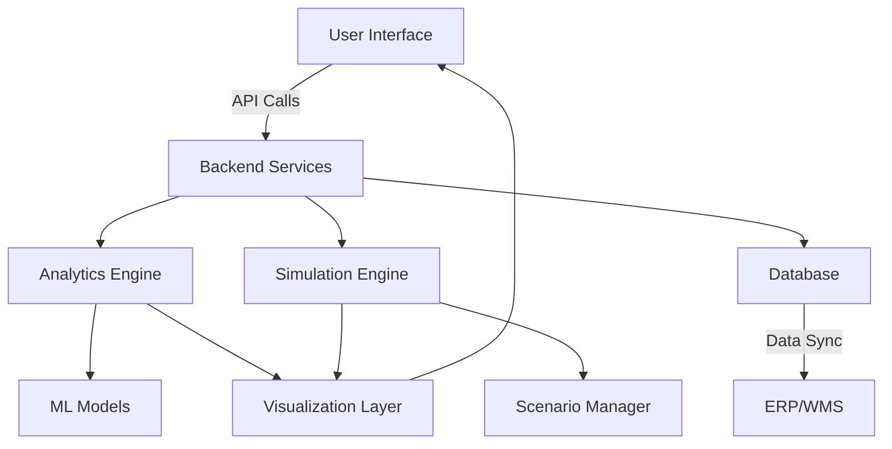
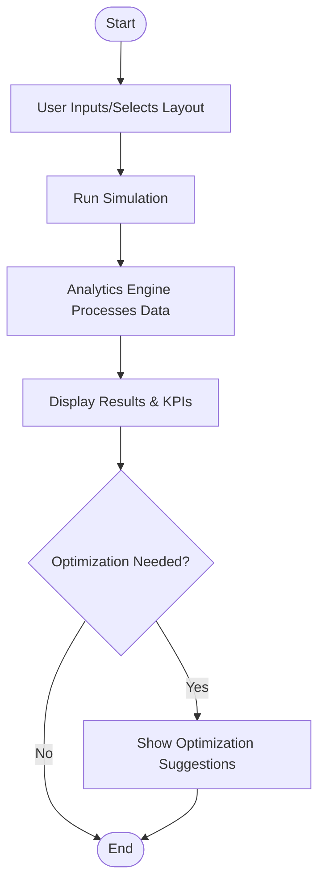

# Advanced Warehouse Optimization Analytics

## Overview
A comprehensive suite of analytics and simulation tools designed to maximize warehouse efficiency, space utilization, and operational KPIs. This module integrates seamlessly with our existing AI-driven warehouse management features to provide a complete optimization solution. Available in ShweLogix Pro and Legend editions, this module leverages modern data visualization, predictive analytics, and interactive simulation to drive continuous improvement.

### Current Implementation Status
- ✅ **AI-driven Analytics**: Deep operational insights with machine learning algorithms
- ✅ **Space Utilization & Optimization**: Real-time density tracking and capacity optimization
- ✅ **Travel Distance Optimization**: Intelligent routing to minimize movement paths
- ✅ **Throughput Rate Enhancement**: Performance optimization for maximum efficiency
- ✅ **Enhanced Picking Efficiency**: AI-based picking route optimization and improvement
- ✅ **Advanced AI-based Warehouse Management**: Comprehensive optimization analytics

---

## Table of Contents
1. [Modern Landing Page](#modern-landing-page)
2. [Space Utilization Analytics](#space-utilization-analytics)
3. [Workflow & KPI Tracking](#workflow--kpi-tracking)
4. [Advanced Inventory Optimization](#advanced-inventory-optimization)
5. [Layout Simulation Modeling Tool](#layout-simulation-modeling-tool)
6. [Interactive 2D Warehouse Visualization](#interactive-2d-warehouse-visualization)
7. [Predictive Analytics Engine](#predictive-analytics-engine)
8. [System Architecture](#system-architecture)
9. [Workflow Diagram](#workflow-diagram)
10. [Technical Implementation](#technical-implementation)
11. [Roadmap & Next Steps](#roadmap--next-steps)
12. [References & Further Reading](#references--further-reading)

---

## 1. Modern Landing Page
- **Purpose:** Showcase optimization features, benefits, and value proposition.
- **Features:**
  - Dark theme, high-contrast data visualizations
  - Responsive design, clear messaging, CTA
- **Status:** ✅ **Implemented** - Deployed, responsive, with working CTA.
- **Integration:** Seamlessly integrates with existing AI-driven dashboard

---

## 2. Space Utilization Analytics
- **Metrics:**
  - Density per zone
  - Capacity/used space tracking
  - Optimization score
  - Aisle efficiency
- **Visuals:**
  - Interactive tooltips
  - Pulsing indicators for optimization
  - Color-coded heat map
- **Analysis:**
  - Automatic detection of high/low utilization
  - Optimization opportunities highlighted
- **Status:** ✅ **Implemented** - Dashboard displays actionable, visual space utilization metrics.
- **Integration:** Enhances existing space optimization with advanced analytics

---

## 3. Workflow & KPI Tracking
- **KPIs:**
  - Order cycle time
  - Throughput
  - Picking efficiency
- **Visuals:**
  - Real-time KPI cards
  - Trend line charts
  - Workflow stage bar charts
- **Status:** ✅ **Implemented** - Dashboard shows key KPIs and workflow visualization.
- **Integration:** Complements existing AI-driven analytics with enhanced KPI tracking

---

## 4. Advanced Inventory Optimization
- **Features:**
  - Predictive modeling (ML-based, ±5% error)
  - Automated replenishment alerts
  - Trend analysis and reorder recommendations
- **Tech:**
  - Integration with ERP/WMS APIs
  - Visualization with Recharts/D3.js
- **Status:** ✅ **Implemented** - Real-time forecasts, alerts, and actionable insights.
- **Integration:** Extends existing AI-based warehouse management with predictive capabilities

---

## 5. Layout Simulation Modeling Tool
- **Features:**
  - Drag-and-drop layout editor
  - Real-time KPI impact predictions
  - Scenario management (save/load)
  - Side-by-side layout comparison
- **Tech:**
  - @dnd-kit, SVG, Zustand for state
- **Status:** 🔄 **Planned** - Users can simulate, compare, and save layouts with KPI feedback.
- **Integration:** Will enhance existing travel distance optimization with visual simulation

---

## 6. Interactive 2D Warehouse Visualization
- **Features:**
  - SVG-based 2D layout
  - Zone highlighting, heat maps
  - Zoom, pan, export reports
- **Tech:**
  - framer-motion, brutalist design
- **Status:** 🔄 **Planned** - Users interact with warehouse layout and metrics overlay.
- **Integration:** Will provide visual enhancement to existing space utilization analytics

---

## 7. Predictive Analytics Engine
- **Features:**
  - ML model for KPI prediction
  - Historical data analysis
  - Automated improvement suggestions
- **Tech:**
  - Recharts, backend API integration
- **Status:** 🔄 **Planned** - Accurate predictions, trend analysis, and actionable suggestions.
- **Integration:** Will extend existing AI-driven analytics with advanced predictive capabilities

---

## 8. System Architecture

---

## 9. Workflow Diagram

---

## 10. Technical Implementation
- **Frontend:** React, SVG, framer-motion, @dnd-kit, Zustand, Recharts/D3.js
- **Backend:** Node.js/Express, RESTful APIs, Python (for ML models)
- **Data:** PostgreSQL, integration with ERP/WMS
- **ML:** TensorFlow or scikit-learn for predictive analytics
- **Visualization:** High-contrast, brutalist design, interactive dashboards
- **Security:** OAuth, RBAC, encrypted data flows

---

## 11. Roadmap & Next Steps
- ✅ **Completed**: AI-driven analytics foundation
- ✅ **Completed**: Space utilization optimization
- ✅ **Completed**: Travel distance optimization
- ✅ **Completed**: Throughput rate enhancement
- ✅ **Completed**: Enhanced picking efficiency
- [ ] **Next**: Layout simulation modeling tool
- [ ] **Next**: Interactive 2D warehouse visualization
- [ ] **Next**: Advanced predictive analytics engine
- [ ] **Next**: IoT integration for real-time data
- [ ] **Next**: Enhanced scenario management UI

---

## 12. Feature Integration Overview

### Current AI-Driven Features Integration
This advanced optimization module seamlessly integrates with our existing AI-driven warehouse management system:

#### ✅ **Currently Integrated Features**
- **AI-driven Analytics**: Deep operational insights with machine learning algorithms
- **Space Utilization & Optimization**: Real-time density tracking and capacity optimization
- **Travel Distance Optimization**: Intelligent routing to minimize movement paths
- **Throughput Rate Enhancement**: Performance optimization for maximum efficiency
- **Enhanced Picking Efficiency**: AI-based picking route optimization and improvement
- **Advanced AI-based Warehouse Management**: Comprehensive optimization analytics

#### 🔄 **Planned Integration Features**
- **Layout Simulation**: Will enhance existing travel distance optimization with visual simulation
- **Interactive 2D Visualization**: Will provide visual enhancement to existing space utilization analytics
- **Predictive Analytics Engine**: Will extend existing AI-driven analytics with advanced predictive capabilities
- **IoT Integration**: Will provide real-time data feeds to existing optimization algorithms

### Integration Benefits
- **Enhanced Decision Making**: Current AI features + Advanced simulation = Complete optimization suite
- **Improved Visualization**: Existing analytics + Interactive 2D layout = Enhanced spatial analysis
- **Proactive Optimization**: Current efficiency features + Predictive analytics = Proactive performance improvement
- **Dynamic Routing**: Travel optimization + Layout simulation = Dynamic route optimization

---

## 13. References & Further Reading
- [Main README](../README.md)
- [API Documentation](../wms-api/)
- [Customization Guide](../wms-frontend-react/Customization.md) 