# Enhanced Module Interactions: Data Flow & Integration Map

This document outlines how the various modules in ShweLogixWMS interact with each other, mapping data flows and dependencies between system components.

## Core Module Interaction Principles

1. **Master Data as the Foundation**
   - Master Data serves as the authoritative source for all reference data
   - All operational modules consume and reference master data
   - Changes to master data trigger notifications to dependent modules

2. **Event-Driven Communication**
   - Modules communicate through events when state changes occur
   - Events follow a publish-subscribe pattern
   - Event schema includes source module, event type, timestamp, and payload

3. **Service-Oriented Architecture**
   - Modules expose services that can be consumed by other modules
   - Service contracts define inputs, outputs, and error conditions
   - Services are versioned to maintain compatibility

4. **Data Consistency Patterns**
   - Transactional boundaries ensure data consistency within modules
   - Eventual consistency patterns for cross-module data
   - Compensation transactions for handling failures in distributed operations

## Module Interaction Map

```mermaid
graph TD
    subgraph "Core Master Data"
        MDM[Master Data Management]
    end
    
    subgraph "Operational Modules"
        INB[Inbound Operations]
        INV[Inventory Management]
        OUT[Outbound Operations]
        WOP[Warehouse Operations]
    end
    
    subgraph "Support Modules"
        FIN[Financial & Billing]
        ANA[Analytics & Reporting]
        NOT[Notification & Alerting]
        DOC[Document & Label Mgmt]
        AUD[Audit & Compliance]
        USR[User & Access Mgmt]
        HLP[Help & Knowledge Base]
        TST[Testing & QA]
    end
    
    subgraph "Integration Layer"
        INT[Integration & API]
    end
    
    %% Master Data feeds all modules
    MDM -->|Reference Data| INB
    MDM -->|Reference Data| INV
    MDM -->|Reference Data| OUT
    MDM -->|Reference Data| WOP
    MDM -->|Reference Data| FIN
    
    %% Operational module interactions
    INB -->|Inventory Receipt| INV
    INB -->|Tasks| WOP
    INV -->|Inventory Status| OUT
    INV -->|Replenishment Tasks| WOP
    OUT -->|Inventory Allocation| INV
    OUT -->|Tasks| WOP
    WOP -->|Task Execution| INB
    WOP -->|Task Execution| INV
    WOP -->|Task Execution| OUT
    
    %% Support module interactions
    INB -->|Cost Data| FIN
    INV -->|Valuation Data| FIN
    OUT -->|Revenue Data| FIN
    WOP -->|Labor Cost| FIN
    
    INB -->|Operational Data| ANA
    INV -->|Inventory Data| ANA
    OUT -->|Fulfillment Data| ANA
    WOP -->|Performance Data| ANA
    FIN -->|Financial Data| ANA
    
    INB -->|Events| NOT
    INV -->|Alerts| NOT
    OUT -->|Events| NOT
    WOP -->|Notifications| NOT
    
    INB -->|Document Requests| DOC
    OUT -->|Label Requests| DOC
    
    %% All modules interact with certain support modules
    INB -->|Audit Events| AUD
    INV -->|Audit Events| AUD
    OUT -->|Audit Events| AUD
    WOP -->|Audit Events| AUD
    FIN -->|Audit Events| AUD
    
    USR -.->|Access Control| INB
    USR -.->|Access Control| INV
    USR -.->|Access Control| OUT
    USR -.->|Access Control| WOP
    USR -.->|Access Control| FIN
    USR -.->|Access Control| ANA
    
    HLP -.->|Context Help| INB
    HLP -.->|Context Help| INV
    HLP -.->|Context Help| OUT
    HLP -.->|Context Help| WOP
    
    TST -.->|Quality Validation| INB
    TST -.->|Quality Validation| INV
    TST -.->|Quality Validation| OUT
    TST -.->|Quality Validation| WOP
    
    %% Integration layer connects to external systems
    INT <-->|External Data| INB
    INT <-->|External Data| INV
    INT <-->|External Data| OUT
    INT <-->|External Data| FIN
```

## Detailed Module Interaction Specifications

### 1. Master Data Management Interactions

| Source Module | Target Module | Interaction Type | Data Elements | Trigger Events |
|---------------|---------------|------------------|--------------|----------------|
| Master Data | Inbound Operations | Reference Data | Products, Suppliers, Warehouses, Locations | Product creation/update, Supplier changes |
| Master Data | Inventory Management | Reference Data | Products, Locations, UOMs, Storage Rules | Location changes, Product attribute updates |
| Master Data | Outbound Operations | Reference Data | Products, Customers, Carriers, Shipping Rules | Customer changes, Carrier updates |
| Master Data | Warehouse Operations | Reference Data | Employees, Equipment, Locations, Zones | Employee updates, Equipment status changes |
| Master Data | Financial & Billing | Reference Data | Cost Centers, GL Accounts, Currencies, Tax Codes | Currency rate changes, Tax code updates |

**Implementation Notes:**
- Master data changes should trigger versioned updates to dependent modules
- Cache invalidation strategies should be implemented for performance
- Modules should handle gracefully when referenced master data is unavailable

### 2. Inbound Operations Interactions

| Source Module | Target Module | Interaction Type | Data Elements | Trigger Events |
|---------------|---------------|------------------|--------------|----------------|
| Inbound | Inventory Management | Inventory Receipt | Products, Quantities, Lots, Locations | GRN creation, Quality approval |
| Inbound | Warehouse Operations | Task Creation | Unloading Tasks, Putaway Tasks, QC Tasks | ASN receipt, Truck arrival, Unloading completion |
| Inbound | Financial & Billing | Cost Data | Receipt values, Handling costs | GRN posting, Service completion |
| Inbound | Document & Label | Document Request | GRN documents, Receiving reports | Receipt completion, Inspection completion |
| Inbound | Notification & Alerting | Event Notification | Receipt alerts, Discrepancy notifications | Receipt variances, Quality failures |

**Implementation Notes:**
- Inbound to Inventory transactions must be atomic to maintain stock accuracy
- Task creation should include priority and deadline information
- Cost data should include labor, equipment, and overhead allocations

### 3. Inventory Management Interactions

| Source Module | Target Module | Interaction Type | Data Elements | Trigger Events |
|---------------|---------------|------------------|--------------|----------------|
| Inventory | Outbound Operations | Availability Data | Available stock, Reserved stock, Allocated stock | Inventory receipt, Stock adjustment |
| Inventory | Warehouse Operations | Task Creation | Cycle count tasks, Replenishment tasks | Stock below minimum, Cycle count due |
| Inventory | Financial & Billing | Valuation Data | Inventory value, Write-offs, Adjustments | Month-end, Inventory adjustment |
| Inventory | Analytics & Reporting | Inventory Data | Stock levels, Inventory turns, Aging | Real-time updates, Daily rollup |
| Inventory | Notification & Alerting | Alert Generation | Low stock alerts, Expiry alerts | Stock below threshold, Approaching expiry |

**Implementation Notes:**
- Inventory status changes should be immediately visible to Outbound Operations
- Inventory valuation should support multiple methods (FIFO, LIFO, Average Cost)
- Threshold-based alerts should be configurable by product category

### 4. Outbound Operations Interactions

| Source Module | Target Module | Interaction Type | Data Elements | Trigger Events |
|---------------|---------------|------------------|--------------|----------------|
| Outbound | Inventory Management | Allocation Request | Products, Quantities, Allocation Strategy | Order creation, Wave planning |
| Outbound | Warehouse Operations | Task Creation | Pick tasks, Pack tasks, Load tasks | Wave release, Packing completion |
| Outbound | Financial & Billing | Revenue Data | Shipping charges, Handling fees | Shipment completion |
| Outbound | Document & Label | Document/Label Request | Shipping labels, BOLs, Packing lists | Order allocation, Packing completion |
| Outbound | Integration & API | External Notification | Shipment notices, Tracking information | Shipment dispatch |

**Implementation Notes:**
- Allocation requests should include reservation duration and priority
- Task creation should optimize for efficiency (zone picking, batch picking)
- Document generation should support customer-specific formats

### 5. Warehouse Operations Interactions

| Source Module | Target Module | Interaction Type | Data Elements | Trigger Events |
|---------------|---------------|------------------|--------------|----------------|
| Warehouse Ops | Inbound Operations | Task Execution | Task status, Completion data | Task assignment, Task completion |
| Warehouse Ops | Inventory Management | Location Updates | Product movements, Confirmations | Task completion |
| Warehouse Ops | Outbound Operations | Task Execution | Pick confirmations, Load confirmations | Task completion |
| Warehouse Ops | Financial & Billing | Labor Data | Labor hours, Equipment usage | Shift end, Task completion |
| Warehouse Ops | Analytics & Reporting | Performance Data | Productivity metrics, Utilization rates | Real-time updates, Shift completion |

**Implementation Notes:**
- Task execution updates should include timestamps, quantities, and exceptions
- Location updates must maintain inventory accuracy and traceability
- Performance data should be collected with minimal impact on operations

### 6. Financial & Billing Interactions

| Source Module | Target Module | Interaction Type | Data Elements | Trigger Events |
|---------------|---------------|------------------|--------------|----------------|
| Financial | Integration & API | Financial Export | GL entries, Invoices, Payments | Period close, Invoice generation |
| Financial | Analytics & Reporting | Financial Data | Cost data, Revenue data, Profitability | Daily rollup, Month-end |
| Financial | Document & Label | Document Request | Invoices, Credit notes, Statements | Billing run, Manual request |
| Financial | Notification & Alerting | Financial Alerts | Payment due, Invoice issues | Payment deadline, Reconciliation errors |

**Implementation Notes:**
- Financial exports should follow accounting standards and formats
- Cost allocation should be traceable to source operations
- Invoice generation should support multiple formats and delivery methods

### 7. Analytics & Reporting Interactions

| Source Module | Target Module | Interaction Type | Data Elements | Trigger Events |
|---------------|---------------|------------------|--------------|----------------|
| Analytics | Notification & Alerting | KPI Alerts | KPI thresholds, Trend alerts | KPI breach, Anomaly detection |
| Analytics | Integration & API | Report Export | Scheduled reports, Ad-hoc exports | Schedule trigger, User request |
| Analytics | Document & Label | Report Generation | Formatted reports, Dashboards | Schedule trigger, User request |

**Implementation Notes:**
- Analytics processing should be isolated from operational systems
- KPI calculations should be consistent across all reporting interfaces
- Report generation should support multiple formats and delivery channels

### 8. Integration & API Interactions

| Source Module | Target Module | Interaction Type | Data Elements | Trigger Events |
|---------------|---------------|------------------|--------------|----------------|
| Integration | Master Data | External Updates | Product data, Partner data | ERP updates, Supplier catalog changes |
| Integration | Inbound Operations | External Triggers | ASNs, Purchase orders | EDI receipt, ERP integration |
| Integration | Outbound Operations | External Orders | Sales orders, Transfer orders | E-commerce orders, ERP orders |
| Integration | Inventory Management | External Adjustments | Inventory adjustments, Transfers | ERP reconciliation |

**Implementation Notes:**
- External updates should go through validation and approval workflows
- Integration errors should be logged and retried with exponential backoff
- API rate limiting should be implemented for external consumers

### 9. Cross-Cutting Module Interactions

| Module | Audit & Compliance | User & Access | Notification & Alerting | Help & Knowledge |
|--------|-------------------|---------------|------------------------|------------------|
| All Modules | Audit logging of all significant actions | Permission checks before operations | Event publication for notifications | Context-sensitive help integration |

**Implementation Notes:**
- Audit logging should be non-blocking and fault-tolerant
- Permission checks should be optimized to minimize performance impact
- Notification rules should be configurable by administrators
- Help content should be versioned to match application versions

## Implementation Strategy

### Phase 1: Core Data Flows (Months 1-3)
- Implement Master Data to Operational Modules reference data flows
- Establish basic Inbound to Inventory transaction flows
- Set up Inventory to Outbound availability data flows
- Create foundational audit logging across all modules

### Phase 2: Operational Interactions (Months 4-9)
- Implement task creation and execution flows between operational modules
- Establish inventory transaction patterns with proper consistency guarantees
- Implement document and label generation flows
- Set up basic financial data collection from operational modules

### Phase 3: Support System Integration (Months 10-15)
- Implement analytics data collection from all operational modules
- Establish notification and alerting patterns
- Integrate help and knowledge base with operational interfaces
- Implement financial reporting and export capabilities

### Phase 4: Advanced Interactions (Months 16-24)
- Implement predictive analytics feedback loops
- Establish advanced optimization algorithms with cross-module data
- Implement machine learning-based task optimization
- Create advanced integration patterns with external systems

## Technical Implementation Considerations

### Event Bus Architecture
- Implement a central event bus for module communication
- Use a message broker (RabbitMQ, Kafka) for reliable delivery
- Define standardized event schemas for consistency
- Implement dead-letter queues for failed event processing

### API Gateway Pattern
- Create a unified API gateway for external and internal consumers
- Implement consistent authentication and authorization
- Provide API versioning and documentation
- Monitor API usage and performance

### Data Consistency Strategies
- Use transactional boundaries within modules
- Implement compensating transactions for cross-module operations
- Apply eventual consistency patterns with reconciliation processes
- Provide conflict resolution strategies for concurrent updates

### Performance Optimization
- Implement caching strategies for reference data
- Use read replicas for reporting and analytics queries
- Apply asynchronous processing for non-critical operations
- Implement batch processing for high-volume operations

### Monitoring and Observability
- Track cross-module transaction flows with correlation IDs
- Monitor event processing latency and throughput
- Implement distributed tracing for complex operations
- Create dashboards for system-wide interaction health