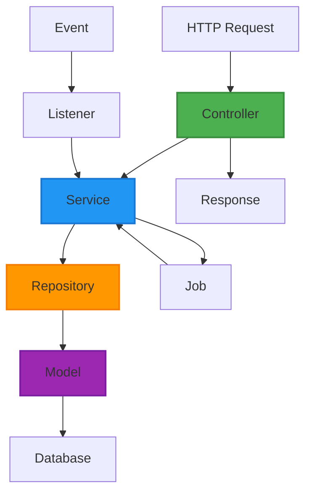
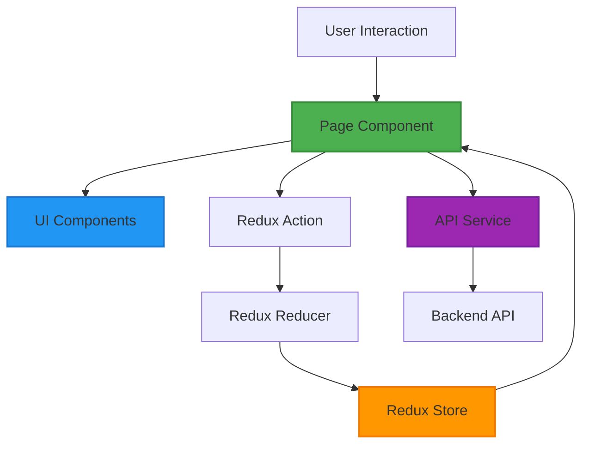

# ShweLogixWMS Project Structure

## Overview

This document provides a detailed overview of the ShweLogixWMS project structure, highlighting the organization of code and resources across the system.

## Directory Structure

```
ShweLogixWMS/
├── docs/                           # Documentation
│   ├── event_driven_architecture.md
│   ├── integration_strategy.md
│   ├── data_flow_architecture.md
│   ├── technical_implementation_details.md
│   ├── implementation-summary.md
│   └── project_structure.md
│
├── wms-api/                        # Backend API (Laravel)
│   ├── app/
│   │   ├── Console/                # Console commands
│   │   ├── Events/                 # Event definitions
│   │   │   ├── Inbound/            # Inbound events
│   │   │   ├── Inventory/          # Inventory events
│   │   │   ├── MasterData/         # Master data events
│   │   │   ├── Notification/       # Notification events
│   │   │   └── Warehouse/          # Warehouse events
│   │   ├── Exceptions/             # Custom exceptions
│   │   ├── Http/
│   │   │   ├── Controllers/        # API controllers
│   │   │   │   ├── Admin/          # Admin controllers
│   │   │   │   ├── Api/            # API controllers
│   │   │   │   ├── Batch/          # Batch processing controllers
│   │   │   │   ├── DataLineage/    # Data lineage controllers
│   │   │   │   ├── Deduplication/  # Deduplication controllers
│   │   │   │   ├── Document/       # Document management controllers
│   │   │   │   ├── EDI/            # EDI/IDoc controllers
│   │   │   │   ├── Optimization/   # Warehouse optimization controllers
│   │   │   │   └── Workflow/       # Workflow engine controllers
│   │   │   ├── Middleware/         # Request middleware
│   │   │   ├── Requests/           # Form requests
│   │   │   └── Resources/          # API resources
│   │   ├── Jobs/                   # Background jobs
│   │   ├── Listeners/              # Event listeners
│   │   │   ├── Inbound/            # Inbound event listeners
│   │   │   ├── Inventory/          # Inventory event listeners
│   │   │   ├── MasterData/         # Master data event listeners
│   │   │   ├── Notification/       # Notification event listeners
│   │   │   └── Warehouse/          # Warehouse event listeners
│   │   ├── Models/                 # Eloquent models
│   │   │   ├── Batch/              # Batch processing models
│   │   │   ├── DataLineage/        # Data lineage models
│   │   │   ├── Deduplication/      # Deduplication models
│   │   │   ├── Document/           # Document management models
│   │   │   ├── EDI/                # EDI/IDoc models
│   │   │   ├── OLAP/               # OLAP models
│   │   │   └── Workflow/           # Workflow engine models
│   │   ├── Providers/              # Service providers
│   │   ├── Repositories/           # Data repositories
│   │   │   ├── Admin/              # Admin repositories
│   │   │   └── BaseRepository.php  # Base repository interface
│   │   ├── Services/               # Business services
│   │   │   └── Integration/        # Integration services
│   │   │       ├── ECommerce/      # E-commerce integration
│   │   │       └── ERP/            # ERP integration
│   │   └── Traits/                 # Reusable traits
│   ├── bootstrap/                  # Application bootstrap
│   ├── config/                     # Configuration files
│   ├── database/                   # Database migrations/seeds
│   │   ├── factories/              # Model factories
│   │   ├── migrations/             # Database migrations
│   │   └── seeders/                # Database seeders
│   ├── public/                     # Public assets
│   ├── resources/                  # Views and assets
│   │   ├── css/                    # CSS files
│   │   ├── js/                     # JavaScript files
│   │   └── views/                  # Blade templates
│   ├── routes/                     # API routes
│   │   ├── api.php                 # Main API routes
│   │   ├── api-advanced.php        # Advanced feature routes
│   │   └── api-olap.php            # OLAP routes
│   ├── storage/                    # Application storage
│   └── tests/                      # Automated tests
│       ├── Feature/                # Feature tests
│       └── Unit/                   # Unit tests
│
├── wms-frontend-react/             # Frontend (React)
│   ├── public/                     # Public assets
│   │   └── images/                 # Image assets
│   └── src/
│       ├── components/             # Reusable components
│       │   ├── auth/               # Authentication components
│       │   ├── charts/             # Chart components
│       │   ├── common/             # Common UI components
│       │   ├── dashboard/          # Dashboard components
│       │   ├── ecommerce/          # E-commerce components
│       │   ├── form/               # Form components
│       │   ├── header/             # Header components
│       │   ├── tables/             # Table components
│       │   └── ui/                 # UI components
│       ├── context/                # React context
│       ├── hooks/                  # Custom hooks
│       ├── icons/                  # SVG icons
│       ├── layout/                 # Layout components
│       ├── lib/                    # Utility libraries
│       ├── pages/                  # Page components
│       │   ├── AuthPages/          # Authentication pages
│       │   ├── BusinessPartyManagement/ # Business party pages
│       │   ├── Dashboard/          # Dashboard pages
│       │   ├── EquipmentManagement/ # Equipment management pages
│       │   ├── EventMonitoring/    # Event monitoring pages
│       │   ├── FinancialManagement/ # Financial management pages
│       │   ├── GeoManagement/      # Geographical management pages
│       │   ├── HrManagement/       # HR management pages
│       │   ├── Inbound/            # Inbound operations pages
│       │   ├── OperationalManagement/ # Operational management pages
│       │   ├── OrderTypeManagement/ # Order type management pages
│       │   ├── Outbound/           # Outbound operations pages
│       │   ├── ProductManagement/  # Product management pages
│       │   ├── ShippingCarrierManagement/ # Shipping carrier pages
│       │   └── WarehouseManagement/ # Warehouse management pages
│       ├── services/               # API services
│       ├── store/                  # Redux store
│       │   └── features/           # Redux slices
│       ├── types/                  # TypeScript types
│       └── utils/                  # Utility functions
│
└── src/                            # Legacy components
    ├── components/                 # Event monitoring components
    │   ├── dashboard/              # Dashboard components
    │   └── notifications/          # Notification components
    ├── pages/                      # Event monitoring pages
    └── services/                   # Event monitoring services
```

## Component Architecture

### Backend Architecture

The backend follows a layered architecture with clear separation of concerns:

1. **Controllers Layer**: Handles HTTP requests and responses
2. **Service Layer**: Contains business logic
3. **Repository Layer**: Abstracts data access
4. **Model Layer**: Represents database entities



### Frontend Architecture

The frontend follows a component-based architecture with Redux for state management:

1. **Pages**: Container components for routes
2. **Components**: Reusable UI components
3. **Services**: API communication
4. **Store**: Redux state management
5. **Hooks**: Custom React hooks
6. **Utils**: Utility functions



## Module Organization

ShweLogixWMS is organized into several logical modules:

### Core Modules
- **Master Data Management**: Product, location, business partner management
- **Inbound Operations**: ASN, receiving, put-away
- **Inventory Management**: Stock tracking, adjustments, cycle counting
- **Outbound Operations**: Order management, picking, shipping
- **Warehouse Operations**: Task management, labor tracking

### Advanced Modules
- **OLAP System**: Analytics and reporting
- **Document Management**: Document storage and versioning
- **Workflow Engine**: Process automation
- **Data Lineage**: Data flow tracking
- **Deduplication Engine**: Data quality management
- **EDI/IDoc Support**: Trading partner integration
- **Batch Processing**: Scheduled job processing
- **Warehouse Optimization**: AI/ML-powered optimization

## Database Schema

The database schema is organized into logical groups:

1. **Master Data Tables**: Products, locations, business partners
2. **Operational Tables**: Inbound, outbound, inventory transactions
3. **Configuration Tables**: System settings, user preferences
4. **Integration Tables**: External system mappings
5. **Analytics Tables**: OLAP fact and dimension tables
6. **Document Tables**: Document storage and metadata
7. **Workflow Tables**: Process definitions and instances
8. **Security Tables**: Users, roles, permissions

## Conclusion

The ShweLogixWMS project follows a well-organized structure that promotes maintainability, scalability, and separation of concerns. The modular architecture allows for independent development and testing of different system components.