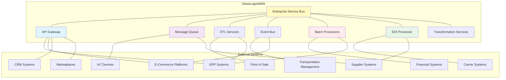

# Integration Strategy: Comprehensive External Systems Integration

This document outlines a detailed integration strategy for ShweLogixWMS, providing a roadmap for connecting with external systems and ensuring seamless data flow across the supply chain ecosystem.

## 1. Integration Architecture Overview

### 1.1 Integration Principles

1. **API-First Approach**
   - All functionality exposed through well-defined APIs
   - Consistent API design patterns
   - Comprehensive API documentation
   - Versioned APIs for backward compatibility

2. **Event-Driven Integration**
   - Publish-subscribe pattern for real-time updates
   - Event normalization for consistent processing
   - Event persistence for reliability
   - Event replay capabilities for recovery

3. **Loose Coupling**
   - Minimal dependencies between systems
   - Well-defined interface contracts
   - Fault isolation
   - Independent scalability

4. **Data Consistency**
   - Clear system of record definitions
   - Eventual consistency patterns
   - Reconciliation mechanisms
   - Data validation at boundaries

5. **Security by Design**
   - Authentication for all integration points
   - Authorization based on least privilege
   - Data encryption in transit and at rest
   - Comprehensive audit logging

### 1.2 Integration Patterns

| Pattern | Use Cases | Benefits | Considerations |
|---------|-----------|----------|----------------|
| **REST APIs** | Master data synchronization, CRUD operations, query operations | Simplicity, wide adoption, statelessness | Limited for real-time updates, potential overhead for frequent polling |
| **GraphQL** | Complex data queries, aggregated data retrieval, client-specific data needs | Flexible data retrieval, reduced network overhead, strong typing | Learning curve, potential backend complexity |
| **Webhooks** | Real-time notifications, status updates, event triggers | Immediate updates, reduced polling, simplicity | Reliability concerns, retry handling, delivery guarantees |
| **Message Queues** | Asynchronous processing, workload distribution, peak handling | Decoupling, buffering, guaranteed delivery | Additional infrastructure, message ordering, idempotency |
| **Batch Processing** | Large data transfers, scheduled reconciliation, reporting | Efficiency for large volumes, scheduled processing | Latency, complexity of error handling, restart capabilities |
| **EDI** | Traditional supply chain integration, carrier integration | Industry standard, wide adoption | Complexity, rigid formats, transformation overhead |
| **File Transfer** | Document exchange, large data sets, legacy integration | Simplicity, wide compatibility | Manual processing, security concerns, lack of real-time capability |

### 1.3 Integration Architecture Diagram

## 2. ERP Integration Strategy

### 2.1 ERP Integration Scope

| Data Domain | Direction | Frequency | Method | Priority |
|-------------|-----------|-----------|--------|----------|
| **Product Master** | ERP → WMS | Real-time / Batch | API / File | High |
| **Customer Master** | ERP → WMS | Real-time / Batch | API / File | High |
| **Supplier Master** | ERP → WMS | Real-time / Batch | API / File | High |
| **Purchase Orders** | ERP → WMS | Real-time | API / EDI | Critical |
| **Sales Orders** | ERP → WMS | Real-time | API / EDI | Critical |
| **Inventory Levels** | WMS → ERP | Real-time / Scheduled | API / File | Critical |
| **Goods Receipts** | WMS → ERP | Real-time | API / EDI | High |
| **Shipment Confirmations** | WMS → ERP | Real-time | API / EDI | High |
| **Inventory Adjustments** | WMS → ERP | Real-time | API | Medium |
| **Inventory Transfers** | Bi-directional | Real-time | API | Medium |
| **Inventory Valuation** | WMS → ERP | Scheduled | API / File | Medium |
| **Production Orders** | ERP → WMS | Real-time | API | Low |
| **Quality Results** | WMS → ERP | Real-time | API | Low |
| **Labor Data** | WMS → ERP | Scheduled | File | Low |

### 2.2 ERP Integration Approaches

#### 2.2.1 SAP ERP Integration

- **Integration Methods**:
  - SAP OData services
  - SAP IDoc interfaces
  - SAP RFC/BAPI calls
  - SAP PI/PO middleware
  - Direct database integration (where appropriate)

- **Key Considerations**:
  - SAP business object mapping
  - SAP authorization and security
  - SAP transaction handling
  - SAP idoc/message monitoring
  - SAP version compatibility

- **Implementation Approach**:
  1. Define SAP integration architecture
  2. Map business objects and fields
  3. Develop SAP-specific connectors
  4. Implement error handling and monitoring
  5. Establish reconciliation processes

#### 2.2.2 Oracle ERP Integration

- **Integration Methods**:
  - Oracle REST APIs
  - Oracle Integration Cloud
  - Oracle SOA Suite
  - Oracle Data Integrator
  - Database integration

- **Key Considerations**:
  - Oracle business object mapping
  - Oracle security model
  - Oracle workflow integration
  - Oracle error handling
  - Oracle Cloud vs. on-premises differences

- **Implementation Approach**:
  1. Define Oracle integration architecture
  2. Map business objects and fields
  3. Develop Oracle-specific connectors
  4. Implement error handling and monitoring
  5. Establish reconciliation processes

#### 2.2.3 Microsoft Dynamics Integration

- **Integration Methods**:
  - Dynamics 365 Web API
  - Dynamics 365 OData
  - Azure Logic Apps
  - Power Automate
  - Direct SQL integration

- **Key Considerations**:
  - Dynamics entity mapping
  - Dynamics security model
  - Dynamics workflow integration
  - Dynamics versioning
  - Cloud vs. on-premises differences

- **Implementation Approach**:
  1. Define Dynamics integration architecture
  2. Map entities and fields
  3. Develop Dynamics-specific connectors
  4. Implement error handling and monitoring
  5. Establish reconciliation processes

### 2.3 ERP Integration Best Practices

1. **Master Data Governance**
   - Clearly define system of record for each data domain
   - Implement data validation at integration points
   - Establish master data synchronization schedules
   - Create conflict resolution procedures
   - Monitor data quality metrics

2. **Transaction Processing**
   - Implement idempotent processing for reliability
   - Establish clear transaction boundaries
   - Create compensation mechanisms for failures
   - Monitor transaction throughput and latency
   - Implement transaction reconciliation processes

3. **Error Handling**
   - Define comprehensive error taxonomy
   - Implement error notification workflows
   - Create error resolution procedures
   - Establish retry policies with exponential backoff
   - Monitor error rates and resolution times

4. **Performance Optimization**
   - Implement caching strategies for reference data
   - Use bulk operations for high-volume data
   - Schedule resource-intensive operations during off-peak hours
   - Monitor integration performance metrics
   - Establish performance SLAs

## 3. E-Commerce & Marketplace Integration

### 3.1 E-Commerce Integration Scope

| Data Domain | Direction | Frequency | Method | Priority |
|-------------|-----------|-----------|--------|----------|
| **Product Catalog** | WMS → E-Commerce | Scheduled | API / File | High |
| **Inventory Availability** | WMS → E-Commerce | Real-time / Near real-time | API / Webhook | Critical |
| **Orders** | E-Commerce → WMS | Real-time | API / Webhook | Critical |
| **Order Status Updates** | WMS → E-Commerce | Real-time | API / Webhook | High |
| **Shipment Tracking** | WMS → E-Commerce | Real-time | API / Webhook | High |
| **Customer Data** | E-Commerce → WMS | Real-time | API | Medium |
| **Returns** | E-Commerce → WMS | Real-time | API | Medium |
| **Pricing** | WMS → E-Commerce | Scheduled | API / File | Low |
| **Product Images/Assets** | WMS → E-Commerce | Scheduled | API / File | Low |

### 3.2 E-Commerce Platform Integration

#### 3.2.1 Shopify Integration

- **Integration Methods**:
  - Shopify REST API
  - Shopify GraphQL API
  - Shopify Webhooks
  - Shopify App Bridge
  - Shopify Flow

- **Key Considerations**:
  - API rate limits
  - Webhook reliability
  - Order fulfillment workflows
  - Inventory buffer management
  - Multi-location inventory

- **Implementation Approach**:
  1. Develop Shopify connector
  2. Implement inventory sync strategy
  3. Create order processing workflow
  4. Establish fulfillment status updates
  5. Implement error handling and monitoring

#### 3.2.2 Magento Integration

- **Integration Methods**:
  - Magento REST API
  - Magento GraphQL API
  - Magento Webhooks
  - Magento Extension
  - Direct database integration

- **Key Considerations**:
  - Complex product structures
  - Multi-website support
  - Custom attribute mapping
  - Order state management
  - Inventory reservation system

- **Implementation Approach**:
  1. Develop Magento connector
  2. Implement inventory sync strategy
  3. Create order processing workflow
  4. Establish fulfillment status updates
  5. Implement error handling and monitoring

#### 3.2.3 WooCommerce Integration

- **Integration Methods**:
  - WooCommerce REST API
  - WooCommerce Webhooks
  - WordPress plugins
  - Direct database integration

- **Key Considerations**:
  - WordPress hosting environment
  - Custom field mapping
  - Product variation handling
  - Order status workflow
  - Performance impact on WordPress

- **Implementation Approach**:
  1. Develop WooCommerce connector
  2. Implement inventory sync strategy
  3. Create order processing workflow
  4. Establish fulfillment status updates
  5. Implement error handling and monitoring

### 3.3 Marketplace Integration

#### 3.3.1 Amazon Integration

- **Integration Methods**:
  - Amazon Selling Partner API
  - Amazon MWS (legacy)
  - Amazon FBA API
  - Amazon Reports

- **Key Considerations**:
  - Amazon-specific requirements
  - FBA vs. FBM fulfillment models
  - Amazon order processing rules
  - Amazon inventory requirements
  - Amazon performance metrics

- **Implementation Approach**:
  1. Develop Amazon connector
  2. Implement listing management
  3. Create order processing workflow
  4. Establish inventory sync strategy
  5. Implement performance monitoring

#### 3.3.2 eBay Integration

- **Integration Methods**:
  - eBay REST API
  - eBay Trading API
  - eBay Notifications
  - eBay Bulk Data Exchange

- **Key Considerations**:
  - eBay listing formats
  - eBay category specifics
  - eBay order workflow
  - eBay payment integration
  - eBay seller performance metrics

- **Implementation Approach**:
  1. Develop eBay connector
  2. Implement listing management
  3. Create order processing workflow
  4. Establish inventory sync strategy
  5. Implement performance monitoring

#### 3.3.3 Walmart Integration

- **Integration Methods**:
  - Walmart Marketplace API
  - Walmart Bulk Operations
  - Walmart Notifications

- **Key Considerations**:
  - Walmart item setup requirements
  - Walmart content quality
  - Walmart order processing rules
  - Walmart shipping requirements
  - Walmart seller performance metrics

- **Implementation Approach**:
  1. Develop Walmart connector
  2. Implement item setup workflow
  3. Create order processing workflow
  4. Establish inventory sync strategy
  5. Implement performance monitoring

### 3.4 Multi-Channel Management

1. **Centralized Inventory**
   - Single inventory pool with allocation rules
   - Channel-specific inventory buffers
   - Real-time inventory updates
   - Oversell prevention strategies
   - Inventory reconciliation processes

2. **Order Routing**
   - Channel identification and tagging
   - Channel-specific fulfillment rules
   - Order prioritization framework
   - Split order handling
   - Cross-channel order consolidation

3. **Unified Product Information**
   - Centralized product information management
   - Channel-specific attribute mapping
   - Content transformation for each channel
   - Digital asset management
   - Product information syndication

4. **Channel Performance Analytics**
   - Channel-specific KPIs
   - Cross-channel performance comparison
   - Profitability analysis by channel
   - Order fulfillment metrics by channel
   - Customer acquisition cost by channel

## 4. Transportation Management System (TMS) Integration

### 4.1 TMS Integration Scope

| Data Domain | Direction | Frequency | Method | Priority |
|-------------|-----------|-----------|--------|----------|
| **Shipment Orders** | WMS → TMS | Real-time | API / EDI | Critical |
| **Shipment Status** | TMS → WMS | Real-time | API / EDI / Webhook | High |
| **Carrier Rates** | TMS → WMS | Real-time / Cached | API | High |
| **Carrier Selection** | Bi-directional | Real-time | API | Medium |
| **Proof of Delivery** | TMS → WMS | Real-time | API / Webhook | Medium |
| **Shipping Labels** | TMS → WMS | Real-time | API | High |
| **Tracking Information** | TMS → WMS | Real-time | API / Webhook | High |
| **Freight Claims** | Bi-directional | Real-time | API | Low |
| **Carrier Invoices** | TMS → WMS | Scheduled | API / EDI | Low |
| **Route Optimization** | TMS → WMS | Real-time / Scheduled | API | Medium |

### 4.2 TMS Integration Approaches

#### 4.2.1 Enterprise TMS Integration

- **Integration Methods**:
  - REST/SOAP APIs
  - EDI (204, 214, 990, etc.)
  - Web services
  - File-based integration
  - Database integration

- **Key Considerations**:
  - Complex shipment structures
  - Multi-leg shipment handling
  - Carrier compliance requirements
  - Rate shopping capabilities
  - Documentation requirements

- **Implementation Approach**:
  1. Define TMS integration architecture
  2. Map shipment data structures
  3. Implement shipment creation and tracking
  4. Establish rate shopping integration
  5. Create document generation workflow

#### 4.2.2 Parcel Carrier Integration

- **Integration Methods**:
  - Carrier-specific APIs
  - Carrier-specific web services
  - Multi-carrier platforms
  - Label printing integration
  - Tracking data integration

- **Key Considerations**:
  - Label generation requirements
  - Tracking number management
  - Service level selection
  - International shipping requirements
  - Dimensional weight calculation

- **Implementation Approach**:
  1. Develop carrier-specific connectors
  2. Implement label generation
  3. Create tracking information processing
  4. Establish rate shopping capabilities
  5. Implement carrier compliance validation

#### 4.2.3 Last-Mile Delivery Integration

- **Integration Methods**:
  - Delivery provider APIs
  - SMS/email notification services
  - Tracking page integration
  - Delivery slot booking APIs
  - Driver mobile app integration

- **Key Considerations**:
  - Delivery slot management
  - Real-time tracking requirements
  - Customer notification preferences
  - Proof of delivery capture
  - Delivery exception handling

- **Implementation Approach**:
  1. Develop last-mile provider connectors
  2. Implement delivery slot booking
  3. Create customer notification workflow
  4. Establish real-time tracking integration
  5. Implement proof of delivery processing

### 4.3 EDI Integration for Transportation

1. **EDI Standards Implementation**
   - EDI 204 (Motor Carrier Load Tender)
   - EDI 214 (Transportation Carrier Shipment Status Message)
   - EDI 210 (Motor Carrier Freight Details and Invoice)
   - EDI 990 (Response to a Load Tender)
   - EDI 997 (Functional Acknowledgment)

2. **EDI Processing Infrastructure**
   - EDI translation services
   - EDI mapping templates
   - EDI validation rules
   - EDI acknowledgment handling
   - EDI error processing

3. **Carrier-Specific Requirements**
   - Carrier-specific EDI versions
   - Carrier-specific data requirements
   - Carrier-specific processing rules
   - Carrier qualification testing
   - Carrier certification processes

4. **EDI Monitoring and Management**
   - EDI transaction logging
   - EDI error alerting
   - EDI performance monitoring
   - EDI partner management
   - EDI version management

## 5. Supplier & Vendor Integration

### 5.1 Supplier Integration Scope

| Data Domain | Direction | Frequency | Method | Priority |
|-------------|-----------|-----------|--------|----------|
| **Purchase Orders** | WMS → Supplier | Real-time / Scheduled | API / EDI / Portal | High |
| **Order Acknowledgments** | Supplier → WMS | Real-time | API / EDI / Portal | Medium |
| **Advanced Shipping Notices** | Supplier → WMS | Real-time | API / EDI | Critical |
| **Inventory Availability** | Supplier → WMS | Scheduled / On-demand | API / Portal | Medium |
| **Product Catalog** | Supplier → WMS | Scheduled | API / File | Medium |
| **Supplier Scorecards** | WMS → Supplier | Scheduled | Portal / File | Low |
| **Quality Data** | Bi-directional | Real-time / Scheduled | API / Portal | Low |
| **Returns/Claims** | WMS → Supplier | Real-time | API / EDI / Portal | Medium |
| **Invoices** | Supplier → WMS | Real-time / Scheduled | API / EDI | Medium |

### 5.2 Supplier Integration Approaches

#### 5.2.1 EDI-Based Supplier Integration

- **Integration Methods**:
  - EDI 850 (Purchase Order)
  - EDI 855 (Purchase Order Acknowledgment)
  - EDI 856 (Advanced Shipping Notice)
  - EDI 810 (Invoice)
  - EDI 812 (Credit/Debit Adjustment)

- **Key Considerations**:
  - Supplier EDI capabilities
  - EDI standards compliance
  - EDI testing and certification
  - EDI monitoring and support
  - Non-EDI alternatives

- **Implementation Approach**:
  1. Assess supplier EDI capabilities
  2. Develop EDI mapping specifications
  3. Implement EDI processing workflows
  4. Establish testing and certification
  5. Create monitoring and support processes

#### 5.2.2 Supplier Portal Integration

- **Integration Methods**:
  - Web-based supplier portal
  - Portal API for system integration
  - Bulk upload/download capabilities
  - Email notifications
  - Mobile access

- **Key Considerations**:
  - Supplier onboarding process
  - User management and security
  - Document management
  - Collaboration features
  - Performance and usability

- **Implementation Approach**:
  1. Define supplier portal requirements
  2. Develop portal functionality
  3. Create supplier onboarding process
  4. Implement document management
  5. Establish performance monitoring

#### 5.2.3 Direct API Integration

- **Integration Methods**:
  - REST APIs
  - GraphQL APIs
  - Webhooks
  - Scheduled data exchange
  - Real-time event notification

- **Key Considerations**:
  - API standardization
  - Authentication and security
  - Rate limiting and throttling
  - Version management
  - Documentation and support

- **Implementation Approach**:
  1. Define API standards and specifications
  2. Develop API endpoints
  3. Create authentication and security
  4. Implement rate limiting and monitoring
  5. Establish documentation and support

### 5.3 Vendor Managed Inventory (VMI)

1. **Inventory Visibility**
   - Real-time inventory level sharing
   - Consumption reporting
   - Forecast sharing
   - Minimum/maximum level management
   - Alert thresholds

2. **Replenishment Automation**
   - Automated replenishment triggers
   - Replenishment order generation
   - Approval workflows
   - Delivery scheduling
   - Performance monitoring

3. **Collaborative Planning**
   - Demand forecast sharing
   - Promotion planning
   - Seasonal planning
   - New product introduction
   - End-of-life management

4. **Performance Metrics**
   - Inventory turns
   - Fill rate
   - On-time delivery
   - Order accuracy
   - Total cost analysis

## 6. IoT & Automation Integration

### 6.1 IoT Integration Scope

| Data Domain | Direction | Frequency | Method | Priority |
|-------------|-----------|-----------|--------|----------|
| **Equipment Status** | IoT → WMS | Real-time | MQTT / API | Medium |
| **Environmental Monitoring** | IoT → WMS | Real-time | MQTT / API | Medium |
| **Asset Tracking** | IoT → WMS | Real-time | MQTT / API | High |
| **Energy Consumption** | IoT → WMS | Real-time / Scheduled | MQTT / API | Low |
| **Predictive Maintenance** | IoT → WMS | Real-time / Scheduled | MQTT / API | Low |
| **Security Systems** | IoT → WMS | Real-time | MQTT / API | Medium |
| **Worker Safety Monitoring** | IoT → WMS | Real-time | MQTT / API | Medium |
| **Equipment Control** | WMS → IoT | Real-time | MQTT / API | Medium |

### 6.2 Automation System Integration

#### 6.2.1 Material Handling Equipment Integration

- **Integration Methods**:
  - PLC integration
  - SCADA systems
  - OPC UA
  - Proprietary control systems
  - Middleware solutions

- **Key Considerations**:
  - Real-time control requirements
  - Safety protocols
  - Error handling and recovery
  - Performance optimization
  - Maintenance integration

- **Implementation Approach**:
  1. Define automation integration architecture
  2. Develop control system interfaces
  3. Implement task dispatching
  4. Create error handling and recovery
  5. Establish performance monitoring

#### 6.2.2 Robotics Integration

- **Integration Methods**:
  - Robot control APIs
  - Fleet management systems
  - Task management interfaces
  - Vision system integration
  - Safety system integration

- **Key Considerations**:
  - Task allocation and scheduling
  - Path planning and optimization
  - Exception handling
  - Human-robot collaboration
  - Performance monitoring

- **Implementation Approach**:
  1. Define robotics integration architecture
  2. Develop robot control interfaces
  3. Implement task allocation system
  4. Create exception handling workflows
  5. Establish performance monitoring

#### 6.2.3 RFID/RTLS Integration

- **Integration Methods**:
  - RFID middleware
  - RTLS platforms
  - Event processing engines
  - Location data services
  - Visualization tools

- **Key Considerations**:
  - Reader infrastructure management
  - Tag management
  - Data filtering and smoothing
  - Location accuracy requirements
  - Integration with business processes

- **Implementation Approach**:
  1. Define RFID/RTLS architecture
  2. Develop middleware integration
  3. Implement event processing
  4. Create business process integration
  5. Establish performance monitoring

### 6.3 IoT Platform Integration

1. **IoT Data Ingestion**
   - MQTT broker integration
   - HTTP/REST endpoints
   - WebSocket connections
   - CoAP support
   - Edge computing integration

2. **Device Management**
   - Device provisioning
   - Configuration management
   - Firmware updates
   - Health monitoring
   - Security management

3. **Data Processing**
   - Stream processing
   - Complex event processing
   - Anomaly detection
   - Data aggregation
   - Data enrichment

4. **Data Storage and Analysis**
   - Time-series databases
   - Data lake integration
   - Analytics processing
   - Machine learning integration
   - Visualization tools

5. **IoT Security**
   - Device authentication
   - Data encryption
   - Access control
   - Vulnerability management
   - Threat detection

## 7. Financial System Integration

### 7.1 Financial Integration Scope

| Data Domain | Direction | Frequency | Method | Priority |
|-------------|-----------|-----------|--------|----------|
| **General Ledger Entries** | WMS → Financial | Scheduled | API / File | High |
| **Accounts Payable** | Bi-directional | Scheduled | API / File | Medium |
| **Accounts Receivable** | Bi-directional | Scheduled | API / File | Medium |
| **Billing Data** | WMS → Financial | Real-time / Scheduled | API / File | High |
| **Cost Accounting** | WMS → Financial | Scheduled | API / File | Medium |
| **Asset Management** | Bi-directional | Scheduled | API / File | Low |
| **Financial Reporting** | Financial → WMS | On-demand | API / File | Low |
| **Tax Data** | WMS → Financial | Scheduled | API / File | Medium |
| **Budget Data** | Financial → WMS | Scheduled | API / File | Low |

### 7.2 Financial Integration Approaches

#### 7.2.1 ERP Financial Module Integration

- **Integration Methods**:
  - ERP financial APIs
  - Journal entry interfaces
  - Financial reporting APIs
  - Batch processing
  - Direct database integration

- **Key Considerations**:
  - Financial period management
  - Transaction batching
  - Reconciliation processes
  - Audit trail requirements
  - Financial controls

- **Implementation Approach**:
  1. Define financial integration architecture
  2. Develop journal entry interfaces
  3. Implement reconciliation processes
  4. Create financial reporting integration
  5. Establish audit and control mechanisms

#### 7.2.2 Standalone Accounting System Integration

- **Integration Methods**:
  - Accounting system APIs
  - File-based integration
  - Batch processing
  - Reporting integration
  - Manual reconciliation support

- **Key Considerations**:
  - Chart of accounts mapping
  - Transaction categorization
  - Batch processing windows
  - Error handling and reconciliation
  - Reporting requirements

- **Implementation Approach**:
  1. Define accounting system integration
  2. Develop transaction processing interfaces
  3. Implement batch processing
  4. Create reconciliation tools
  5. Establish reporting integration

#### 7.2.3 Billing System Integration

- **Integration Methods**:
  - Billing system APIs
  - Invoice generation interfaces
  - Payment processing integration
  - Customer portal integration
  - Reporting integration

- **Key Considerations**:
  - Billing event capture
  - Rate card application
  - Invoice generation timing
  - Payment application
  - Dispute management

- **Implementation Approach**:
  1. Define billing system integration
  2. Develop billing event interfaces
  3. Implement invoice generation
  4. Create payment processing integration
  5. Establish reporting and analytics

### 7.3 Financial Data Governance

1. **Financial Data Quality**
   - Data validation rules
   - Reconciliation processes
   - Exception handling
   - Data correction workflows
   - Audit trail maintenance

2. **Financial Controls**
   - Segregation of duties
   - Approval workflows
   - Limit checks
   - Audit logging
   - Compliance verification

3. **Financial Reporting**
   - Standard financial reports
   - Custom reporting capabilities
   - Regulatory reporting
   - Management reporting
   - Financial dashboards

4. **Financial Compliance**
   - SOX compliance
   - GAAP/IFRS compliance
   - Tax compliance
   - Industry-specific regulations
   - Audit support

## 8. Integration Implementation Roadmap

### 8.1 Phase 1: Foundation (Months 1-3)

1. **Integration Architecture**
   - Define integration principles and patterns
   - Select integration technologies
   - Design API gateway
   - Establish security framework
   - Create monitoring strategy

2. **Core API Development**
   - Develop master data APIs
   - Create inventory APIs
   - Implement basic transaction APIs
   - Establish authentication and authorization
   - Create API documentation

3. **Integration Infrastructure**
   - Set up API gateway
   - Implement message queue
   - Configure event bus
   - Establish integration database
   - Deploy monitoring tools

### 8.2 Phase 2: Primary Integrations (Months 4-9)

1. **ERP Integration**
   - Implement product master integration
   - Develop order integration
   - Create inventory synchronization
   - Establish financial integration
   - Implement reconciliation processes

2. **E-Commerce Integration**
   - Develop inventory availability API
   - Implement order processing
   - Create shipment status updates
   - Establish product catalog synchronization
   - Implement return processing

3. **Supplier Integration**
   - Implement purchase order integration
   - Develop ASN processing
   - Create supplier portal
   - Establish quality data exchange
   - Implement invoice processing

### 8.3 Phase 3: Advanced Integrations (Months 10-15)

1. **TMS Integration**
   - Implement shipment creation
   - Develop rate shopping
   - Create tracking integration
   - Establish carrier-specific integrations
   - Implement documentation generation

2. **Marketplace Integration**
   - Develop Amazon integration
   - Implement eBay integration
   - Create Walmart integration
   - Establish multi-channel inventory
   - Implement order routing

3. **IoT & Automation Integration**
   - Implement equipment status monitoring
   - Develop asset tracking
   - Create environmental monitoring
   - Establish automation control interfaces
   - Implement predictive maintenance

### 8.4 Phase 4: Optimization & Expansion (Months 16-24)

1. **Advanced Analytics Integration**
   - Implement data warehouse integration
   - Develop BI tool integration
   - Create predictive analytics
   - Establish machine learning pipelines
   - Implement visualization integration

2. **Extended Partner Integration**
   - Develop 3PL integration
   - Implement customer system integration
   - Create vendor managed inventory
   - Establish collaborative forecasting
   - Implement extended supply chain visibility

3. **Financial Ecosystem Integration**
   - Implement advanced financial integration
   - Develop tax system integration
   - Create audit support tools
   - Establish compliance reporting
   - Implement financial analytics

## 9. Integration Governance & Management

### 9.1 Integration Standards

1. **API Standards**
   - REST API design guidelines
   - GraphQL schema design
   - Naming conventions
   - Versioning strategy
   - Documentation requirements

2. **Data Standards**
   - Data formats (JSON, XML, etc.)
   - Data validation rules
   - Error response formats
   - Pagination standards
   - Filtering and sorting conventions

3. **Security Standards**
   - Authentication requirements
   - Authorization models
   - Data protection requirements
   - Audit logging standards
   - Vulnerability management

4. **Performance Standards**
   - Response time requirements
   - Throughput expectations
   - Rate limiting policies
   - Caching strategies
   - Scalability requirements

### 9.2 Integration Monitoring & Support

1. **Operational Monitoring**
   - Real-time status dashboards
   - Transaction volume monitoring
   - Error rate tracking
   - Performance metrics
   - SLA compliance

2. **Alerting & Notification**
   - Error alerting
   - Threshold-based alerts
   - Escalation procedures
   - On-call rotation
   - Resolution tracking

3. **Troubleshooting Tools**
   - Transaction tracing
   - Log analysis
   - Error reproduction
   - Test environments
   - Diagnostic utilities

4. **Support Processes**
   - Incident management
   - Problem management
   - Change management
   - Release management
   - Knowledge management

### 9.3 Integration Lifecycle Management

1. **Version Management**
   - API versioning
   - Deprecation policies
   - Backward compatibility
   - Migration support
   - Version sunset planning

2. **Partner Onboarding**
   - Partner qualification
   - Integration specification
   - Development support
   - Testing and certification
   - Production deployment

3. **Change Management**
   - Impact assessment
   - Change notification
   - Testing requirements
   - Rollback planning
   - Post-implementation review

4. **Continuous Improvement**
   - Performance optimization
   - Error reduction initiatives
   - Feature enhancement
   - Technology upgrades
   - Architecture evolution

## 10. Integration Security Framework

### 10.1 Authentication & Authorization

1. **Authentication Methods**
   - API keys
   - OAuth 2.0
   - JWT
   - Client certificates
   - IP whitelisting

2. **Authorization Models**
   - Role-based access control
   - Attribute-based access control
   - Scope-based authorization
   - Resource-level permissions
   - Tenant isolation

3. **Credential Management**
   - Secure storage
   - Rotation policies
   - Revocation procedures
   - Emergency access
   - Audit logging

### 10.2 Data Protection

1. **Data in Transit**
   - TLS encryption
   - Certificate management
   - Cipher suite configuration
   - Perfect forward secrecy
   - Protocol security

2. **Data at Rest**
   - Encryption standards
   - Key management
   - Secure storage
   - Data classification
   - Retention policies

3. **Sensitive Data Handling**
   - PII identification
   - Data masking
   - Tokenization
   - Minimization principles
   - Access controls

### 10.3 Threat Protection

1. **API Security**
   - Input validation
   - Output encoding
   - Rate limiting
   - OWASP Top 10 protection
   - API-specific threats

2. **Vulnerability Management**
   - Security scanning
   - Penetration testing
   - Dependency analysis
   - Patch management
   - Security advisories

3. **Incident Response**
   - Detection capabilities
   - Response procedures
   - Containment strategies
   - Recovery processes
   - Post-incident analysis

### 10.4 Compliance Requirements

1. **Industry Standards**
   - ISO 27001
   - SOC 2
   - PCI DSS
   - HIPAA
   - GDPR

2. **Audit Capabilities**
   - Comprehensive logging
   - Access tracking
   - Change history
   - Non-repudiation
   - Evidence collection

3. **Compliance Reporting**
   - Compliance dashboards
   - Automated assessments
   - Gap analysis
   - Remediation tracking
   - Certification support