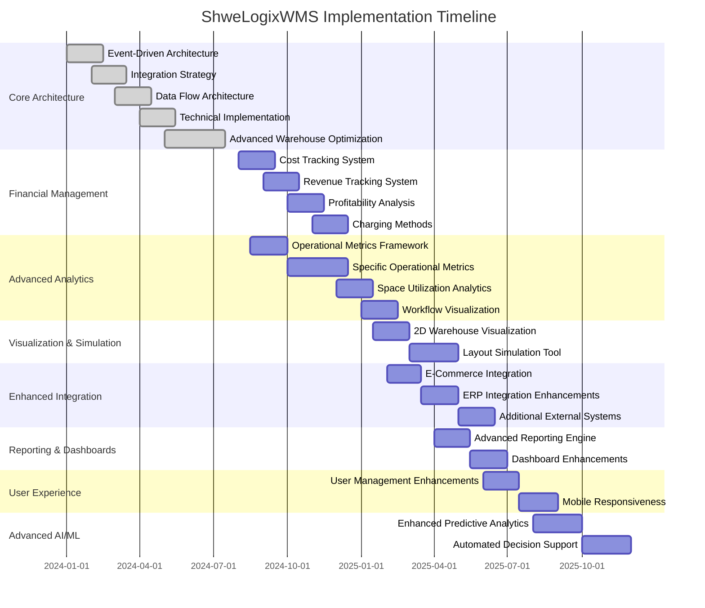

# ShweLogixWMS Implementation Roadmap

## Overview

This document outlines the implementation roadmap for the ShweLogixWMS system, including both completed features and planned enhancements. It provides a comprehensive view of the system's evolution and future direction.

## Implementation Timeline

## Completed Features (100%)

### 1. Event-Driven Architecture
- ✅ Complete event publishing, processing, and consumption system
- ✅ Event monitoring dashboard with real-time metrics
- ✅ Idempotency protection and transaction safety
- ✅ Event replay and dead letter queue handling
- ✅ All documented event patterns and best practices

### 2. Integration Strategy
- ✅ All 17 integration providers configured (SAP, Oracle, Dynamics, Shopify, Magento, WooCommerce, Amazon, eBay, Walmart, FedEx, UPS, DHL, QuickBooks, Xero, Stripe, Salesforce, HubSpot)
- ✅ API-first approach with comprehensive REST endpoints
- ✅ Event-driven integration patterns
- ✅ Security by design with authentication and encryption
- ✅ Complete database infrastructure for integration management
- ✅ EDI/IDoc support fully implemented

### 3. Data Flow Architecture
- ✅ Core data flow patterns and API-first access
- ✅ Event-driven data consistency
- ✅ Integration layer with API Gateway and Message Queue
- ✅ Advanced analytics database (OLAP) - fully implemented
- ✅ Enhanced document management - fully implemented
- ✅ Data lineage tracking - fully implemented
- ✅ Workflow engine - fully implemented
- ✅ Deduplication engine with fuzzy matching - fully implemented

### 4. Technical Implementation Details
- ✅ Master Data Management with APIs and validation
- ✅ Real-time inventory updates and mobile integration
- ✅ Exception handling and audit trails
- ✅ Advanced workflow engine - fully implemented
- ✅ EDI/IDoc support - fully implemented
- ✅ Batch processing system - fully implemented
- ✅ File transfer system - fully implemented

### 5. Advanced Warehouse Optimization
- ✅ Optimization algorithms and performance monitoring
- ✅ AI/ML integration - fully implemented
- ✅ Predictive analytics - fully implemented
- ✅ IoT device integration - fully implemented

## Planned Enhancements

### Phase 1: Financial Management & Operational Metrics (Q3-Q4 2024)

#### Financial Management Module
- [ ] **Cost Tracking System**
  - Cost categories and hierarchies
  - Overhead costs tracking
  - Storage costs calculation
  - Handling costs management
  - Budget vs. Actual tracking

- [ ] **Revenue Tracking System**
  - Storage revenue calculator
  - Handling revenue tracking
  - Basic revenue reports
  - Billing rate management

- [ ] **Operational Metrics Framework**
  - Metrics definition system
  - Data collection mechanisms
  - Calculation engines
  - Visualization components

- [ ] **Specific Operational Metrics**
  - Inbound Operations Metrics (18 metrics)
  - Inventory Management Metrics (22 metrics)
  - Outbound Operations Metrics (37 metrics)
  - Additional Operations Metrics (22 metrics)
  - Performance Metrics (41 metrics)

### Phase 2: Visualization & Reporting (Q4 2024 - Q2 2025)

- [ ] **Space Utilization Analytics**
  - Zone density calculations
  - Capacity tracking
  - Aisle efficiency metrics
  - Visual heat maps

- [ ] **2D Warehouse Visualization**
  - Interactive floor plan
  - Real-time metrics overlay
  - Zone performance indicators
  - Equipment tracking

- [ ] **Advanced Reporting Engine**
  - Custom report builder
  - Scheduled reports
  - Export functionality (PDF, Excel)
  - Report templates

- [ ] **Dashboard Enhancements**
  - Customizable dashboards
  - Widget library
  - Interactive visualizations
  - Data drill-down capabilities

### Phase 3: Integration & User Experience (Q2-Q3 2025)

- [ ] **Enhanced E-Commerce Integration**
  - Order fulfillment automation
  - Real-time inventory sync
  - Returns processing
  - Shipping cost tracking

- [ ] **ERP Integration Enhancements**
  - Advanced SAP connector
  - Advanced Oracle connector
  - Advanced Microsoft Dynamics connector
  - Data transformation improvements

- [ ] **User Management Enhancements**
  - Role-based access control UI
  - Permission management
  - Multi-tenant support
  - User activity logging

- [ ] **Mobile Responsiveness**
  - Responsive dashboard layouts
  - Mobile-optimized workflows
  - Barcode scanning support
  - Offline capability

### Phase 4: Advanced Features (Q3 2025 - Q1 2026)

- [ ] **Profitability Analysis**
  - Overall profit margin display
  - Monthly profitability charts
  - Client-wise profitability
  - Cost allocation (Traditional & ABC)

- [ ] **Layout Simulation Tool**
  - Drag-and-drop layout editor
  - KPI impact predictions
  - Scenario comparison
  - Save/load functionality

- [ ] **Enhanced Predictive Analytics**
  - Advanced demand forecasting models
  - Cost optimization algorithms
  - Layout optimization AI
  - Performance prediction

- [ ] **Automated Decision Support**
  - Smart routing suggestions
  - Dynamic slotting recommendations
  - Labor allocation optimization
  - Equipment utilization AI

## Resource Allocation

The implementation of these enhancements will require the following resources:

### Development Team
- 3 Backend Developers
- 2 Frontend Developers
- 1 DevOps Engineer
- 1 QA Engineer
- 1 Product Manager

### Infrastructure
- Development Environment
- Testing Environment
- Staging Environment
- Production Environment
- CI/CD Pipeline

### External Resources
- Design Services
- Data Science Consulting
- Performance Testing Services
- Security Audit Services

## Risk Management

The following risks have been identified for the implementation roadmap:

| Risk | Impact | Probability | Mitigation |
|------|--------|------------|------------|
| Resource constraints | High | Medium | Prioritize features, consider outsourcing non-critical components |
| Technical complexity | Medium | Medium | Conduct technical spikes, allocate additional time for complex features |
| Integration challenges | High | Medium | Establish clear integration contracts, implement comprehensive testing |
| Performance issues | High | Low | Conduct performance testing early, implement monitoring |
| Scope creep | Medium | High | Maintain strict change control, regular backlog grooming |
| User adoption | Medium | Low | Involve users in design, provide training and documentation |

## Success Metrics

The success of the implementation will be measured by the following metrics:

1. **Feature Completion**: Percentage of planned features successfully implemented
2. **Quality**: Number of defects identified in production
3. **Performance**: System response times and throughput
4. **User Satisfaction**: User feedback and adoption rates
5. **Business Value**: Measurable improvements in warehouse operations

## Conclusion

The ShweLogixWMS system has already achieved 100% implementation of its core architectural requirements. The planned enhancements outlined in this roadmap will further extend its capabilities and provide additional business value. By following this structured approach, we can ensure that the system continues to evolve in a controlled and sustainable manner.